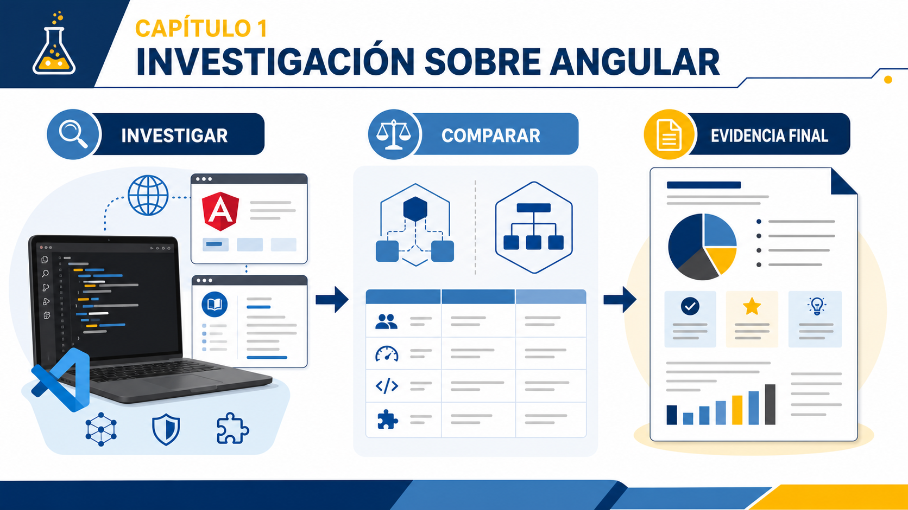
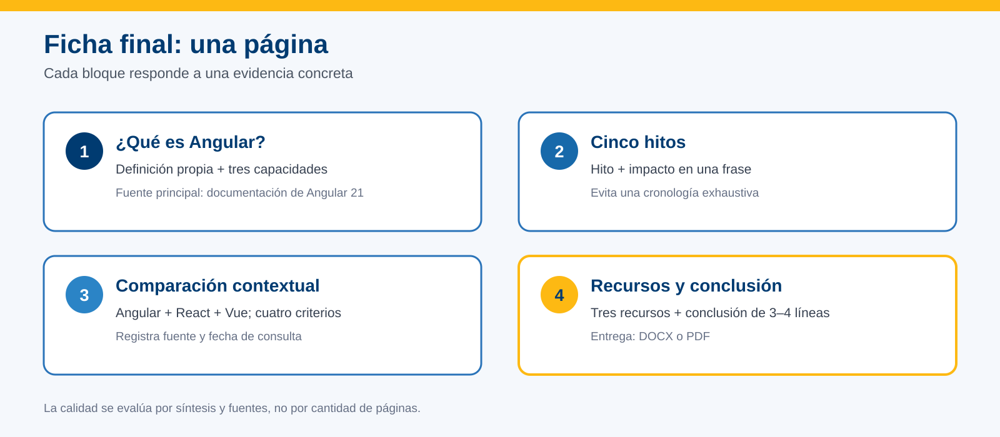
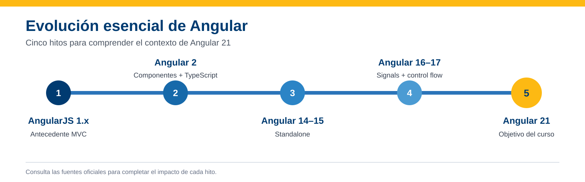

# Investigación sobre Angular



## Información de la práctica

| Campo | Detalle |
|---|---|
| **Duración** | 41 minutos |
| **Modalidad** | Investigación guiada, sin escritura de código |
| **Versión objetivo** | Angular 21 |
| **Entregable** | Una ficha de investigación de una página |

## Objetivo

Investigar Angular mediante fuentes confiables para identificar sus capacidades principales, reconocer hitos de su evolución, compararlo de forma razonada con otras alternativas y seleccionar recursos útiles para el resto del curso.

## Recursos

- Navegador web moderno: Chrome o Microsoft Edge.
- Editor para completar la ficha: Word, Google Docs, VS Code o equivalente.
- Documentación de Angular 21: https://v21.angular.dev/overview
- Historial oficial de versiones: https://github.com/angular/angular/releases
- Política de versiones: https://angular.dev/reference/releases
- Una fuente comparativa elegida por el instructor o el participante.

> **Importante:** La documentación principal de `angular.dev` puede mostrar una versión posterior. Para las características del curso, utiliza la documentación de Angular 21 enlazada arriba.

## Entregable

Crea un documento llamado:

```text
Lab01_Investigacion_Angular_Apellido_Nombre.docx
```

También puedes entregarlo en PDF. Debe contener solamente estas cuatro secciones:

1. ¿Qué es Angular?
2. Cinco hitos de evolución.
3. Comparación Angular, React y Vue.
4. Recursos seleccionados y conclusión.



---

## Paso 1. Identificar qué ofrece Angular

**Tiempo sugerido: 7 minutos**

1. Abre https://v21.angular.dev/overview.
2. Localiza el título **What is Angular?**.
3. Lee la definición inicial y revisa la sección de capacidades.
4. En la primera sección de tu ficha escribe:
   - una definición de Angular con tus propias palabras;
   - tres capacidades que consideres relevantes;
   - una razón por la que Angular puede ser apropiado para aplicaciones mantenidas por equipos.

No copies párrafos completos. Sintetiza la información en un máximo de ocho líneas.

### Resultado esperado

La ficha contiene una definición propia y tres capacidades respaldadas por la documentación oficial.

### Comprobación

- [ ] Utilicé la documentación de Angular 21.
- [ ] Puedo explicar por qué Angular es un framework y no solamente una biblioteca de interfaz.
- [ ] Registré la URL consultada.

---

## Paso 2. Seleccionar cinco hitos de evolución

**Tiempo sugerido: 8 minutos**

Consulta https://github.com/angular/angular/releases y la siguiente guía. Selecciona los cinco hitos y escribe una frase sobre la importancia de cada uno.



| Hito | Qué debes registrar |
|---|---|
| AngularJS 1.x | El antecedente y su arquitectura distinta |
| Angular 2 | La reescritura basada en componentes y TypeScript |
| Angular 14–15 | Introducción y estabilización de componentes standalone |
| Angular 16–17 | Signals y nuevo control de flujo en templates |
| Angular 21 | Versión objetivo del curso y consolidación del enfoque moderno |

> **Nota:** Angular 3 no se publicó. No necesitas documentar cada versión intermedia ni memorizar fechas exactas.

### Resultado esperado

Una tabla con cinco hitos y una frase de impacto por hito.

### Comprobación

- [ ] Distingo AngularJS de Angular moderno.
- [ ] Identifiqué Angular 21 como versión objetivo.
- [ ] Evité convertir la actividad en una cronología de todas las versiones.

---

## Paso 3. Comparar Angular, React y Vue

**Tiempo sugerido: 9 minutos**

Elige una fuente comparativa indicada por el instructor. Puede ser una encuesta reciente o una herramienta de tendencias. Registra la fecha de consulta porque estos datos cambian.

Completa la tabla usando frases breves. No elijas un ganador universal: relaciona cada alternativa con un contexto.

| Criterio | Angular | React | Vue |
|---|---|---|---|
| Alcance de la herramienta | | | |
| Convenciones y estructura | | | |
| Curva de aprendizaje | | | |
| Contexto en el que la elegirías | | | |

Después de la tabla, responde en tres líneas:

> Para un proyecto con varios equipos, reglas compartidas y mantenimiento de largo plazo, ¿qué aspectos considerarías antes de elegir una tecnología?

### Resultado esperado

Una comparación cualitativa sustentada, sin basarse únicamente en el número de descargas.

### Comprobación

- [ ] Registré la fuente y la fecha de consulta.
- [ ] Separé popularidad de adecuación técnica.
- [ ] Mi conclusión menciona el contexto del proyecto.

---

## Paso 4. Seleccionar recursos y concluir

**Tiempo sugerido: 8 minutos**

Revisa los siguientes recursos y selecciona los tres que utilizarías primero durante el curso:

| Recurso | Uso principal |
|---|---|
| https://v21.angular.dev | Documentación correspondiente a Angular 21 |
| https://github.com/angular/angular | Código fuente, releases e incidencias |
| https://blog.angular.dev | Anuncios del equipo de Angular |
| https://angular.dev/tools/cli | Referencia de Angular CLI |
| https://stackoverflow.com/questions/tagged/angular | Problemas concretos; validar respuestas contra fuentes oficiales |

En tu ficha:

1. Anota los tres recursos elegidos.
2. Escribe una razón breve para cada elección.
3. Redacta una conclusión personal de tres o cuatro líneas:
   - qué te parece más útil de Angular;
   - qué tema esperas practicar durante el curso;
   - qué fuente consultarás primero cuando tengas una duda.

### Resultado esperado

Tres recursos priorizados y una conclusión breve relacionada con el curso.

---

## Validación final

**Tiempo sugerido: 4 minutos**

Antes de entregar, verifica:

- [ ] La ficha tiene las cuatro secciones solicitadas.
- [ ] La definición está escrita con mis palabras.
- [ ] La cronología contiene cinco hitos, no una lista exhaustiva.
- [ ] La comparación usa cuatro criterios y menciona el contexto.
- [ ] Incluí las URLs y la fecha de consulta de datos variables.
- [ ] La conclusión tiene entre tres y cuatro líneas.
- [ ] El documento está guardado con el nombre indicado.

## Evidencia que debes entregar

Un archivo DOCX o PDF de una página —dos como máximo si el formato lo requiere— con:

- definición y tres capacidades;
- cinco hitos;
- tabla comparativa;
- tres recursos prioritarios;
- conclusión breve;
- fuentes consultadas.

## Si un sitio no está disponible

Utiliza otra fuente oficial incluida en esta práctica y registra cuál no estuvo disponible. No inviertas tiempo buscando capturas antiguas ni datos sin procedencia.

## Nota para el instructor

El margen de tres minutos puede utilizarse para conectividad o para compartir una conclusión con el grupo. La evaluación debe centrarse en síntesis, uso de fuentes y razonamiento contextual, no en la cantidad de páginas.

