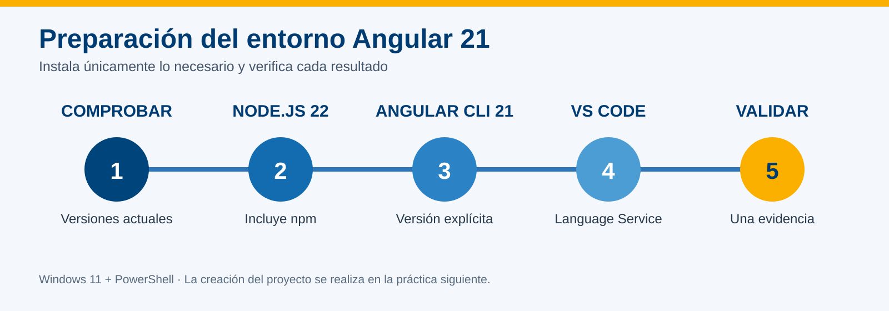
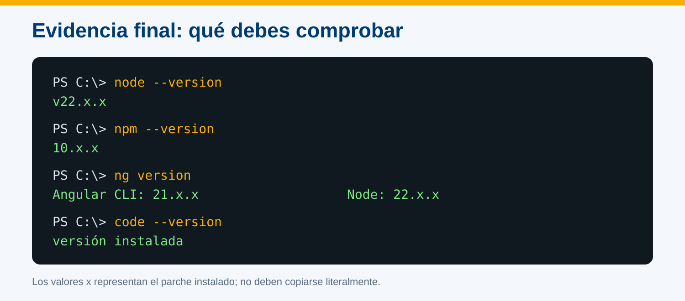
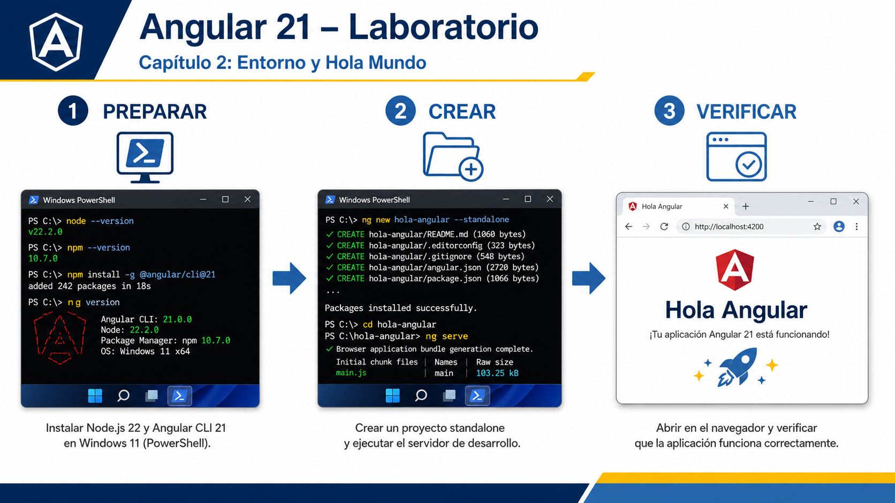
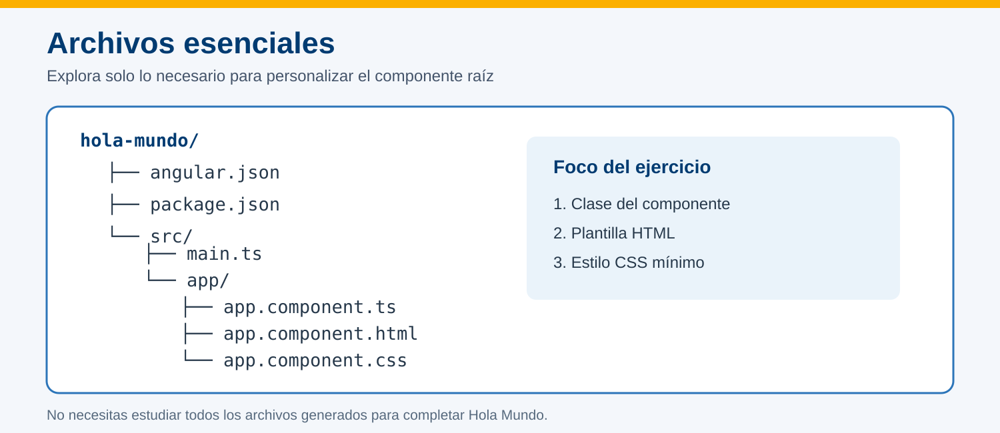
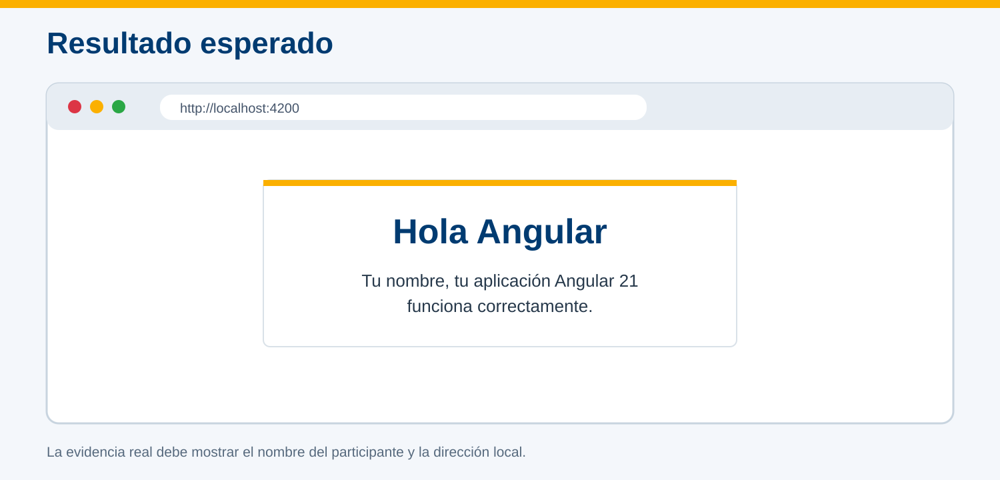

# Instalación del software para el desarrollo con Angular



## Información de la práctica

| Campo | Detalle |
| --- | --- |
| **Duración contractual** | 49 minutos |
| **Plataforma objetivo** | Windows 11 con PowerShell |
| **Versiones del curso** | Node.js 22 LTS y Angular CLI 21 |
| **Resultado** | Entorno validado para comenzar las prácticas Angular |

## Objetivo

Instalar o verificar las herramientas mínimas del curso: Node.js 22 LTS, npm, Angular CLI 21, Visual Studio Code y Angular Language Service.

> Esta práctica prepara el entorno. La creación y ejecución de una aplicación Angular se realiza en la práctica siguiente.

## Recursos

- Conexión a Internet.
- Permisos para instalar aplicaciones en Windows.
- PowerShell.
- [Node.js](https://nodejs.org/en/download)
- [Visual Studio Code](https://code.visualstudio.com/download)
- [Angular Language Service](https://marketplace.visualstudio.com/items?itemName=Angular.ng-template)

## Evidencia

Al finalizar entrega **una captura de PowerShell** donde sean visibles, en este orden:

```text
node --version
npm --version
ng version
code --version
```

La evidencia debe mostrar Node.js `v22.x`, Angular CLI `21.x` y la versión instalada de VS Code. El parche exacto de Node.js y npm puede variar.

---

## Paso 1. Comprobar el estado inicial

**Tiempo sugerido: 4 minutos**

1. Abre **PowerShell**.
2. Ejecuta cada comando por separado:

```powershell
node --version
npm --version
ng version
code --version
```

3. Si una herramienta ya cumple la versión indicada, marca su instalación como completada y continúa con la siguiente.
4. Si PowerShell indica que un comando no se reconoce, realiza el paso correspondiente.

> Después de instalar una herramienta, cierra y vuelve a abrir PowerShell para actualizar el `PATH`.

---

## Paso 2. Instalar Node.js 22 LTS

**Tiempo sugerido: 13 minutos**

1. Abre [nodejs.org/en/download](https://nodejs.org/en/download).
2. Selecciona una versión **22.x LTS** para Windows y descarga el instalador `.msi` apropiado para tu equipo.
3. Ejecuta el instalador.
4. Conserva la ruta predeterminada y asegúrate de que la opción para agregar Node.js al `PATH` permanezca habilitada.
5. Completa el asistente. No es necesario instalar herramientas adicionales para módulos nativos en esta práctica.
6. Cierra PowerShell, ábrelo nuevamente y ejecuta:

```powershell
node --version
npm --version
```

**Resultado esperado:**

```text
v22.x.x
10.x.x
```

El número exacto de parche puede cambiar. npm se instala junto con Node.js.

---

## Paso 3. Instalar Angular CLI 21

**Tiempo sugerido: 9 minutos**

1. En PowerShell ejecuta:

```powershell
npm install --global @angular/cli@21
```

2. Verifica la instalación:

```powershell
ng version
```

3. Localiza estas líneas en la salida:

```text
Angular CLI: 21.x.x
Node: 22.x.x
Package Manager: npm 10.x.x
```

> Usa siempre la versión explícita `@angular/cli@21`. Así el entorno permanece alineado con la versión contractual del curso.

Si `ng` no se reconoce, cierra todas las ventanas de PowerShell y abre una nueva. Después repite `ng version`.

---

## Paso 4. Instalar y preparar Visual Studio Code

**Tiempo sugerido: 10 minutos**

1. Descarga VS Code desde [code.visualstudio.com/download](https://code.visualstudio.com/download).
2. Ejecuta el instalador para Windows.
3. Durante la instalación, habilita **Agregar a PATH** y **Abrir con Code** cuando esas opciones estén disponibles.
4. Abre VS Code.
5. Presiona `Ctrl+Shift+X` para abrir **Extensiones**.
6. Busca **Angular Language Service**, publicado por **Angular**, e instálalo.
7. Cierra y abre de nuevo PowerShell; ejecuta:

```powershell
code --version
```

Angular Language Service proporciona asistencia para templates Angular. No es necesario instalar colecciones de snippets, temas, iconos ni extensiones de depuración del navegador para completar esta práctica.

---

## Paso 5. Verificar el entorno completo

**Tiempo sugerido: 8 minutos**

Ejecuta los comandos de la siguiente imagen y compara las líneas clave, no los números exactos de parche.



```powershell
node --version
npm --version
ng version
code --version
```

Comprueba:

- [ ] `node --version` comienza con `v22.`.
- [ ] `npm --version` muestra una versión disponible.
- [ ] `ng version` muestra Angular CLI `21.x` y no presenta errores de compatibilidad.
- [ ] `code --version` devuelve una versión.
- [ ] Angular Language Service aparece como instalada en VS Code.

---

## Validación y entrega

**Tiempo sugerido: 3 minutos**

1. Ajusta el tamaño de PowerShell para que las cuatro verificaciones sean legibles.
2. Oculta nombres de usuario, rutas personales o información sensible si aparecen.
3. Toma una sola captura y guárdala como:

```text
practica-02-entorno-angular.png
```

## Solución rápida de problemas

| Situación | Acción |
| --- | --- |
| Un comando no se reconoce después de instalar | Cierra todas las terminales y abre PowerShell de nuevo. |
| `ng version` reporta otra versión mayor | Ejecuta `npm install --global @angular/cli@21` y vuelve a verificar. |
| El instalador solicita permisos | Solicita apoyo al instructor; no cambies políticas del equipo. |
| La descarga es lenta | Continúa con una instalación previamente descargada por el instructor. |
| `code` no se reconoce | Verifica VS Code desde el menú Inicio; el instructor puede corregir el `PATH`. |

## Nota para el instructor

El presupuesto incluye **dos minutos de margen** para descargas, reinicios de terminal o permisos. Si el software ya está instalado, el participante debe verificar las versiones y preparar la evidencia; no necesita desinstalar ni reinstalar herramientas compatibles.

---

# Crea el proyecto Hola Mundo de Angular y verifica que funcione correctamente



## Información de la práctica

| Campo | Detalle |
| --- | --- |
| **Duración contractual** | 49 minutos |
| **Plataforma** | Windows 11 con PowerShell |
| **Versión** | Angular CLI 21 |
| **Arquitectura** | Standalone |
| **Resultado** | Aplicación “Hola Mundo” funcionando en el navegador |

## Objetivo

Crear un proyecto Angular 21 con Angular CLI, reconocer sus archivos esenciales, ejecutar el servidor de desarrollo y personalizar el componente raíz para mostrar un mensaje en el navegador.

## Prerrequisitos

- Haber completado la práctica de instalación.
- `node --version` comienza con `v22.`.
- `ng version` muestra Angular CLI `21.x`.
- Visual Studio Code está disponible.

## Evidencia

Entrega una captura del navegador donde se observe:

- el título **Hola Angular**;
- tu nombre;
- la dirección `http://localhost:4200`.

---

## Paso 1. Preparar el directorio de trabajo

**Tiempo sugerido: 3 minutos**

Abre PowerShell y ejecuta:

```powershell
Set-Location $env:USERPROFILE
New-Item -ItemType Directory -Path angular-labs -Force
Set-Location angular-labs
```

Comprueba la ubicación:

```powershell
Get-Location
```

La ruta debe terminar en `angular-labs`.

---

## Paso 2. Crear el proyecto Angular

**Tiempo sugerido: 12 minutos**

Ejecuta el comando en una sola línea:

```powershell
ng new hola-mundo --routing=false --style=css --standalone --skip-git --skip-tests --file-name-style-guide=2016
```

Las opciones mantienen el ejercicio enfocado:

| Opción | Resultado |
| --- | --- |
| `--standalone` | Usa la arquitectura recomendada para código nuevo |
| `--routing=false` | No agrega Router porque todavía no se utiliza |
| `--style=css` | Crea hojas CSS |
| `--skip-tests` | Omite archivos de pruebas en esta práctica |
| `--skip-git` | No crea un repositorio dentro del laboratorio |
| `--file-name-style-guide=2016` | Conserva nombres como `app.component.ts` |

Cuando finalice, confirma que existe la carpeta:

```powershell
Test-Path .\hola-mundo
```

**Resultado esperado:** `True`.

---

## Paso 3. Reconocer la estructura mínima

**Tiempo sugerido: 7 minutos**

1. Entra al proyecto y ábrelo en VS Code:

```powershell
Set-Location .\hola-mundo
code .
```

2. Localiza únicamente estos archivos:



| Archivo | Función en esta práctica |
| --- | --- |
| `src/main.ts` | Inicia la aplicación standalone |
| `src/app/app.component.ts` | Define el componente raíz |
| `src/app/app.component.html` | Contiene su vista |
| `src/app/app.component.css` | Contiene sus estilos |
| `package.json` | Registra scripts y dependencias |
| `angular.json` | Configura el workspace |

No es necesario revisar el contenido completo de `angular.json`, `tsconfig.json` ni `package-lock.json`.

---

## Paso 4. Ejecutar la aplicación inicial

**Tiempo sugerido: 7 minutos**

En PowerShell, dentro de `hola-mundo`, ejecuta:

```powershell
ng serve --open
```

Espera hasta observar un mensaje de compilación completada. El navegador debe abrir:

```text
http://localhost:4200
```

Mantén esta terminal abierta. Para detener el servidor al finalizar utiliza `Ctrl+C`.

> Si el puerto 4200 está ocupado, ejecuta `ng serve --open --port 4201` y utiliza esa dirección en la evidencia.

---

## Paso 5. Personalizar el componente raíz

**Tiempo sugerido: 12 minutos**

### 5.1 Editar la clase

Reemplaza el contenido de `src/app/app.component.ts` por:

```typescript
import { Component } from '@angular/core';

@Component({
  selector: 'app-root',
  imports: [],
  templateUrl: './app.component.html',
  styleUrl: './app.component.css',
})
export class AppComponent {
  readonly nombre = 'Escribe aquí tu nombre';
}
```

### 5.2 Editar la plantilla

Reemplaza `src/app/app.component.html` por:

```html
<main class="contenedor">
  <h1>Hola Angular</h1>
  <p>{{ nombre }}, tu aplicación Angular 21 funciona correctamente.</p>
</main>
```

### 5.3 Aplicar un estilo mínimo

Reemplaza `src/app/app.component.css` por:

```css
.contenedor {
  max-width: 720px;
  margin: 4rem auto;
  padding: 2rem;
  text-align: center;
  font-family: Arial, sans-serif;
  border-top: 8px solid #fbb000;
  box-shadow: 0 4px 18px #0002;
}

h1 {
  color: #003b71;
}
```

Guarda los tres archivos. El servidor debe recompilar y actualizar el navegador automáticamente.

---

## Paso 6. Verificar y entregar

**Tiempo sugerido: 5 minutos**

Compara tu resultado con la referencia. Tu nombre debe sustituir el texto de ejemplo.



Comprueba:

- [ ] La terminal no muestra errores de compilación.
- [ ] El navegador muestra **Hola Angular**.
- [ ] Aparece tu nombre mediante interpolación `{{ nombre }}`.
- [ ] La página responde en `localhost:4200` o en el puerto alternativo indicado.
- [ ] La captura no contiene información personal ajena a la práctica.

Guarda la evidencia como:

```text
practica-03-hola-mundo.png
```

Después de tomarla, vuelve a PowerShell y presiona `Ctrl+C` para detener el servidor.

## Solución rápida de problemas

| Situación | Acción |
| --- | --- |
| `ng` no se reconoce | Reabre PowerShell y verifica `ng version`. |
| La creación se interrumpe | Confirma la conexión y vuelve a ejecutar el comando desde `angular-labs`. |
| El puerto 4200 está ocupado | Usa `ng serve --open --port 4201`. |
| La página no cambia | Guarda los archivos y revisa el primer error mostrado en la terminal. |
| No existe `app.component.ts` | Confirma que utilizaste `--file-name-style-guide=2016`. |

## Nota para el instructor

El presupuesto incluye **tres minutos de margen** para la instalación de dependencias o la recompilación inicial. No añadir build de producción, DevTools, routing ni análisis exhaustivo de configuración: esos contenidos no son necesarios para obtener el resultado contractual de esta práctica.
