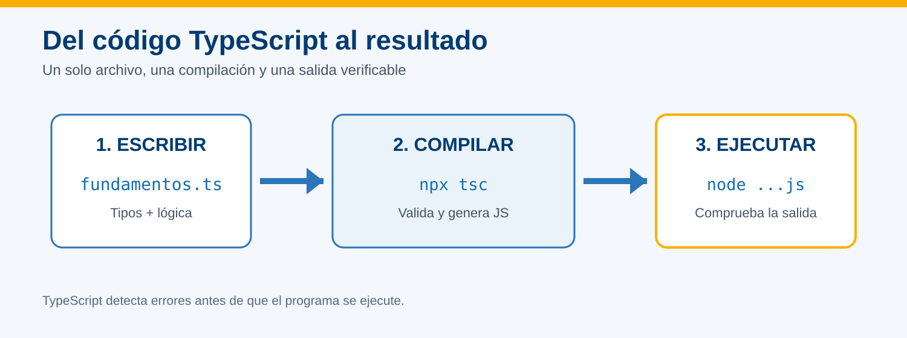
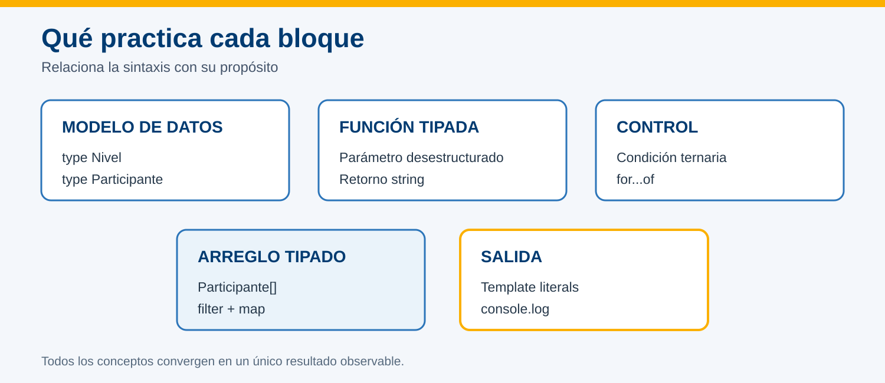
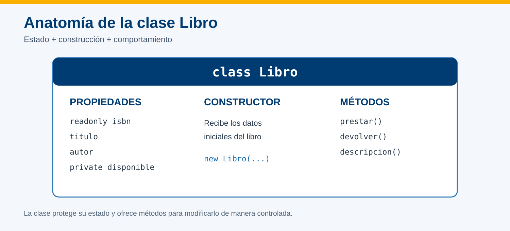
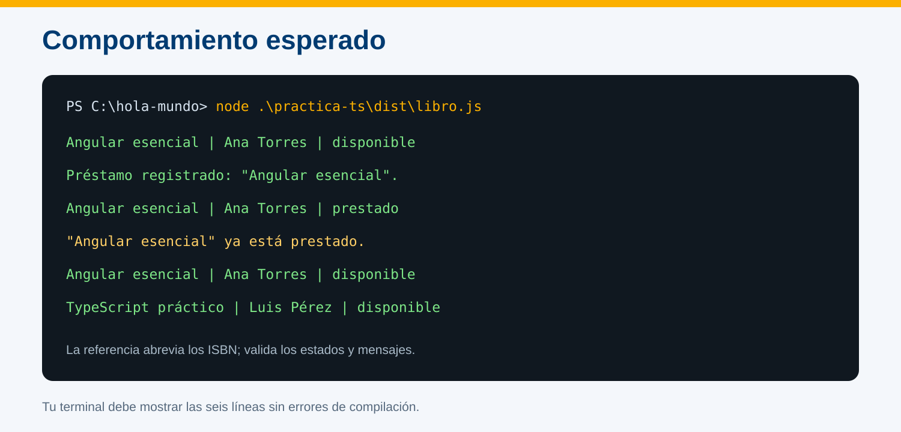

# Programación con TypeScript



## Información de la práctica

| Campo | Detalle |
| --- | --- |
| **Duración contractual** | 26 minutos |
| **Plataforma** | Windows 11 con PowerShell |
| **Herramientas** | TypeScript local, Node.js 22 y VS Code |
| **Resultado** | Programa TypeScript compilado y ejecutado |

## Objetivo

Construir un programa breve que aplique tipos, funciones, control de flujo, arreglos, métodos funcionales y desestructuración; después compilarlo a JavaScript y ejecutarlo con Node.js.

## Prerrequisitos

- Proyecto `hola-mundo` creado en la práctica anterior.
- Node.js 22 disponible.
- Dependencias del proyecto instaladas.
- Visual Studio Code disponible.

## Evidencia

Entrega una captura de PowerShell con la compilación sin errores y la salida completa del programa.

---

## Paso 1. Preparar el ejercicio

**Tiempo sugerido: 3 minutos**

Abre PowerShell y entra al proyecto de la práctica anterior:

```powershell
Set-Location $env:USERPROFILE\angular-labs\hola-mundo
New-Item -ItemType Directory -Path practica-ts -Force
code .
```

En VS Code crea:

```text
practica-ts/fundamentos.ts
```

> El ejercicio usa `npx tsc`, que ejecuta la versión de TypeScript instalada dentro del proyecto. No requiere una instalación global adicional.

---

## Paso 2. Escribir un programa tipado

**Tiempo sugerido: 11 minutos**

Copia este contenido en `practica-ts/fundamentos.ts`:

```typescript
type Nivel = 'inicial' | 'intermedio';

type Participante = {
  nombre: string;
  edad: number;
  activo: boolean;
  nivel: Nivel;
};

const participantes: Participante[] = [
  { nombre: 'Ana', edad: 28, activo: true, nivel: 'inicial' },
  { nombre: 'Luis', edad: 34, activo: false, nivel: 'intermedio' },
  { nombre: 'Marta', edad: 31, activo: true, nivel: 'intermedio' },
];

function describir({ nombre, edad, nivel }: Participante): string {
  const categoria = edad >= 30 ? '30 años o más' : 'menor de 30';
  return `${nombre} | ${nivel} | ${categoria}`;
}

const resumen: string[] = participantes
  .filter((participante) => participante.activo)
  .map(describir);

for (const linea of resumen) {
  console.log(linea);
}

console.log(`Total activo: ${resumen.length}`);
```

Antes de continuar, identifica en el código:

- el tipo unión `Nivel`;
- el tipo de objeto `Participante`;
- el arreglo tipado;
- los parámetros y retorno de `describir`;
- la condición ternaria;
- `filter`, `map`, `for...of` y la desestructuración.



---

## Paso 3. Compilar y ejecutar

**Tiempo sugerido: 5 minutos**

Desde la raíz de `hola-mundo`, ejecuta:

```powershell
npx tsc .\practica-ts\fundamentos.ts --target ES2022 --outDir .\practica-ts\dist
node .\practica-ts\dist\fundamentos.js
```

**Salida esperada:**

```text
Ana | inicial | menor de 30
Marta | intermedio | 30 años o más
Total activo: 2
```

Si `npx tsc` no muestra mensajes, la compilación terminó sin errores.

---

## Paso 4. Comprobar el tipado

**Tiempo sugerido: 3 minutos**

1. Cambia temporalmente la edad de Ana por un texto:

```typescript
{ nombre: 'Ana', edad: 'veintiocho', activo: true, nivel: 'inicial' },
```

2. Compila nuevamente:

```powershell
npx tsc .\practica-ts\fundamentos.ts --target ES2022 --outDir .\practica-ts\dist
```

3. Observa que TypeScript informa que `string` no puede asignarse a `number`.
4. Restablece `edad: 28`, guarda y vuelve a compilar.

Este error intencional no debe permanecer en la entrega.

---

## Paso 5. Validar y entregar

**Tiempo sugerido: 2 minutos**

- [ ] `fundamentos.ts` conserva tipos explícitos.
- [ ] La última compilación finaliza sin errores.
- [ ] Existe `practica-ts/dist/fundamentos.js`.
- [ ] La salida contiene solo Ana, Marta y el total `2`.
- [ ] La captura muestra el comando y la salida legible.

Guarda la evidencia como:

```text
practica-04-typescript.png
```

## Solución rápida de problemas

| Situación | Acción |
| --- | --- |
| No existe la carpeta `hola-mundo` | Confirma la ruta creada en la práctica anterior. |
| `npx` solicita instalar otro paquete | Cancela y confirma que ejecutas el comando dentro de `hola-mundo`. |
| La compilación muestra el error intencional | Restablece `edad: 28` y guarda el archivo. |
| Node no encuentra el JavaScript | Verifica que la compilación creó `practica-ts/dist/fundamentos.js`. |

## Nota para el instructor

El presupuesto reserva **dos minutos de margen**. La práctica no pretende repetir toda la teoría de TypeScript: busca comprobar que el participante puede leer, modificar, compilar y ejecutar un programa tipado. Los temas de clases y orientación a objetos se trabajan en la práctica siguiente.

---

# Escribir un programa en TypeScript que defina una clase de Objetos llamada Libro



## Información de la práctica

| Campo | Detalle |
| --- | --- |
| **Duración contractual** | 26 minutos |
| **Plataforma** | Windows 11 con PowerShell |
| **Herramientas** | TypeScript local, Node.js 22 y VS Code |
| **Resultado** | Clase `Libro` compilada y ejecutada |

## Objetivo

Definir una clase `Libro` con propiedades tipadas, constructor, encapsulación y métodos; crear objetos y comprobar su comportamiento en la consola.

## Prerrequisitos

- Proyecto `hola-mundo` disponible con sus dependencias.
- Práctica de fundamentos de TypeScript completada.
- Carpeta `practica-ts` existente.

## Evidencia

Entrega una captura de PowerShell que muestre la compilación final sin errores y la salida completa de los dos libros.

---

## Paso 1. Preparar el archivo

**Tiempo sugerido: 3 minutos**

Abre PowerShell y entra al proyecto:

```powershell
Set-Location $env:USERPROFILE\angular-labs\hola-mundo
code .
```

En VS Code crea:

```text
practica-ts/libro.ts
```

---

## Paso 2. Definir la clase `Libro`

**Tiempo sugerido: 10 minutos**

Copia este código en `practica-ts/libro.ts`:

```typescript
class Libro {
  private disponible = true;

  constructor(
    public readonly isbn: string,
    public titulo: string,
    public autor: string,
  ) {}

  prestar(): string {
    if (!this.disponible) {
      return `"${this.titulo}" ya está prestado.`;
    }

    this.disponible = false;
    return `Préstamo registrado: "${this.titulo}".`;
  }

  devolver(): void {
    this.disponible = true;
  }

  descripcion(): string {
    const estado = this.disponible ? 'disponible' : 'prestado';
    return `${this.isbn} | ${this.titulo} | ${this.autor} | ${estado}`;
  }
}
```

Identifica:

- `class Libro`: definición del tipo de objeto;
- `private disponible`: estado accesible solo dentro de la clase;
- `readonly isbn`: valor que no debe cambiar después de construir el objeto;
- parámetros `public`: propiedades creadas desde el constructor;
- `prestar`, `devolver` y `descripcion`: comportamiento del objeto;
- `this`: referencia a la instancia actual.

---

## Paso 3. Crear y utilizar objetos

**Tiempo sugerido: 6 minutos**

Debajo de la clase agrega:

```typescript
const libroAngular = new Libro(
  '978-1-11111-111-1',
  'Angular esencial',
  'Ana Torres',
);

const libroTypeScript = new Libro(
  '978-2-22222-222-2',
  'TypeScript práctico',
  'Luis Pérez',
);

console.log(libroAngular.descripcion());
console.log(libroAngular.prestar());
console.log(libroAngular.descripcion());
console.log(libroAngular.prestar());

libroAngular.devolver();
console.log(libroAngular.descripcion());
console.log(libroTypeScript.descripcion());
```

Antes de ejecutar, predice:

1. qué estado mostrará el primer libro después de `prestar()`;
2. qué mensaje aparecerá al intentar prestarlo por segunda vez;
3. qué estado tendrá después de `devolver()`.

---

## Paso 4. Compilar y ejecutar

**Tiempo sugerido: 4 minutos**

Desde la raíz de `hola-mundo`, ejecuta:

```powershell
npx tsc .\practica-ts\libro.ts --target ES2022 --outDir .\practica-ts\dist
node .\practica-ts\dist\libro.js
```

Compara la salida con esta referencia:



```text
978-1-11111-111-1 | Angular esencial | Ana Torres | disponible
Préstamo registrado: "Angular esencial".
978-1-11111-111-1 | Angular esencial | Ana Torres | prestado
"Angular esencial" ya está prestado.
978-1-11111-111-1 | Angular esencial | Ana Torres | disponible
978-2-22222-222-2 | TypeScript práctico | Luis Pérez | disponible
```

---

## Paso 5. Validar y entregar

**Tiempo sugerido: 1 minuto**

- [ ] La clase se llama `Libro`.
- [ ] `isbn` es `readonly` y `disponible` es `private`.
- [ ] Existen constructor y tres métodos.
- [ ] Se crean dos objetos con `new Libro(...)`.
- [ ] La compilación finaliza sin errores.
- [ ] La salida demuestra préstamo duplicado y devolución.

Guarda la captura como:

```text
practica-05-clase-libro.png
```

## Solución rápida de problemas

| Situación | Acción |
| --- | --- |
| Se intenta acceder a `disponible` desde fuera | Usa `descripcion()`, `prestar()` o `devolver()`. |
| TypeScript marca argumentos faltantes | Comprueba los tres valores enviados al constructor. |
| Node no encuentra `libro.js` | Verifica que la compilación creó `practica-ts/dist/libro.js`. |
| La salida no cambia a `prestado` | Confirma que ejecutas `prestar()` antes de la segunda descripción. |

## Nota para el instructor

El presupuesto conserva **dos minutos de margen**. No ampliar el ejercicio con patrones avanzados ni una arquitectura de múltiples archivos: eso convertiría una práctica de clase básica en un proyecto distinto al resultado contractual.
