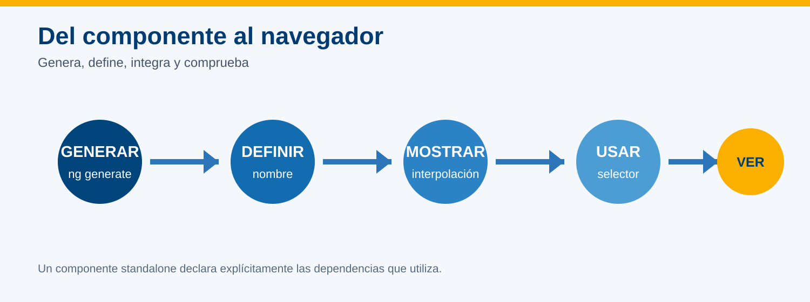
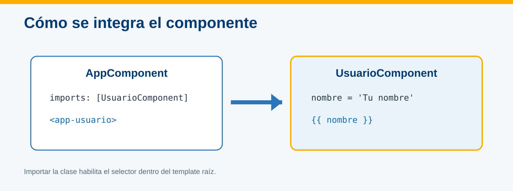
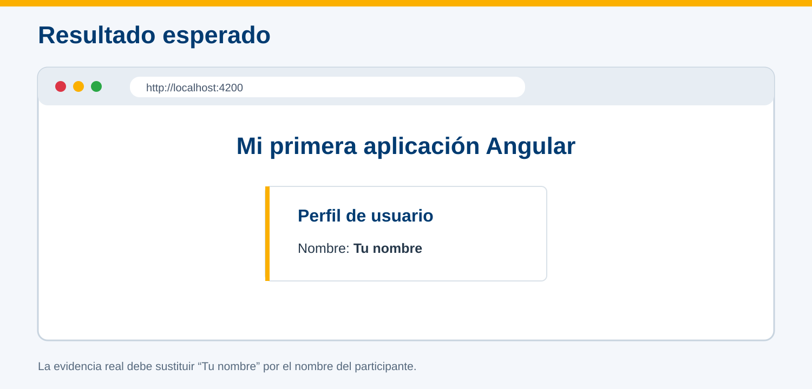

# Crear un componente simple que muestre el nombre de un usuario en la página web de la aplicación



## Información de la práctica

| Campo | Detalle |
| --- | --- |
| **Duración contractual** | 49 minutos |
| **Plataforma** | Windows 11 con PowerShell |
| **Versión** | Angular CLI 21 |
| **Arquitectura** | Componentes standalone |
| **Resultado** | Nombre de un usuario mostrado por un componente |

## Objetivo

Generar un componente standalone, definir una propiedad `nombre`, mostrarla mediante interpolación e integrar el componente en la vista raíz.

## Prerrequisitos

- Proyecto `hola-mundo` creado anteriormente.
- Angular CLI 21 disponible.
- Visual Studio Code disponible.
- Conocimientos básicos de clase, propiedad y template HTML.

## Evidencia

Entrega una captura del navegador que muestre el encabezado de la aplicación y la tarjeta del usuario con tu nombre.

---

## Paso 1. Abrir y verificar el proyecto

**Tiempo sugerido: 5 minutos**

Abre PowerShell:

```powershell
Set-Location $env:USERPROFILE\angular-labs\hola-mundo
code .
```

Confirma que estás en la carpeta correcta:

```powershell
Test-Path .\src\app\app.component.ts
```

**Resultado esperado:** `True`.

> Si tu proyecto usa nombres como `app.ts`, vuelve a la práctica 3 y confirma que se creó con `--file-name-style-guide=2016`.

---

## Paso 2. Generar el componente

**Tiempo sugerido: 7 minutos**

Desde la raíz de `hola-mundo`, ejecuta:

```powershell
ng generate component usuario --skip-tests --type=component
```

Angular CLI debe crear:

```text
src/app/usuario/
├── usuario.component.ts
├── usuario.component.html
└── usuario.component.css
```

Abre `usuario.component.ts`. En Angular 21 los componentes son standalone por defecto; no necesitan declararse en un módulo raíz.

---

## Paso 3. Definir el nombre del usuario

**Tiempo sugerido: 7 minutos**

Reemplaza `src/app/usuario/usuario.component.ts` por:

```typescript
import { Component } from '@angular/core';

@Component({
  selector: 'app-usuario',
  imports: [],
  templateUrl: './usuario.component.html',
  styleUrl: './usuario.component.css',
})
export class UsuarioComponent {
  readonly nombre = 'Escribe aquí tu nombre';
}
```

La propiedad pertenece a la instancia del componente. `readonly` indica que el ejercicio no necesita modificarla después de inicializarla.

---

## Paso 4. Mostrar la propiedad en el template

**Tiempo sugerido: 8 minutos**

Reemplaza `src/app/usuario/usuario.component.html` por:

```html
<section class="usuario">
  <h2>Perfil de usuario</h2>
  <p>Nombre: <strong>{{ nombre }}</strong></p>
</section>
```

`{{ nombre }}` es interpolación: Angular evalúa la propiedad del componente y escribe su valor en el HTML.

Agrega en `usuario.component.css`:

```css
.usuario {
  max-width: 520px;
  margin: 2rem auto;
  padding: 1.5rem;
  border-left: 8px solid #fbb000;
  box-shadow: 0 4px 16px #0002;
}

h2 {
  margin-top: 0;
  color: #003b71;
}
```

---

## Paso 5. Integrar el componente en `AppComponent`

**Tiempo sugerido: 8 minutos**

### 5.1 Importar la clase

Reemplaza `src/app/app.component.ts` por:

```typescript
import { Component } from '@angular/core';
import { UsuarioComponent } from './usuario/usuario.component';

@Component({
  selector: 'app-root',
  imports: [UsuarioComponent],
  templateUrl: './app.component.html',
  styleUrl: './app.component.css',
})
export class AppComponent {}
```

### 5.2 Usar el selector

Reemplaza `src/app/app.component.html` por:

```html
<main>
  <h1>Mi primera aplicación Angular</h1>
  <app-usuario></app-usuario>
</main>
```

La integración requiere dos acciones: importar `UsuarioComponent` en `imports` y utilizar su selector `<app-usuario>` en el template.



---

## Paso 6. Ejecutar y comprobar

**Tiempo sugerido: 5 minutos**

Ejecuta:

```powershell
ng serve --open
```

Espera la compilación y verifica `http://localhost:4200`.

El resultado debe ser similar a esta referencia:



Comprueba:

- [ ] La terminal no muestra errores.
- [ ] Aparece **Mi primera aplicación Angular**.
- [ ] La tarjeta muestra **Perfil de usuario**.
- [ ] Tu nombre aparece dentro de la tarjeta.
- [ ] No se muestra literalmente `{{ nombre }}`.

---

## Paso 7. Guardar evidencia

**Tiempo sugerido: 5 minutos**

1. Mantén visible la dirección `localhost:4200`.
2. Toma una captura donde se observe la aplicación completa.
3. Guárdala como:

```text
practica-06-componente-usuario.png
```

4. Detén el servidor con `Ctrl+C` cuando termines.

## Solución rápida de problemas

| Situación | Acción |
| --- | --- |
| `app-usuario is not a known element` | Confirma `imports: [UsuarioComponent]` y la ruta del import. |
| No aparece el nombre | Revisa que la propiedad y `{{ nombre }}` tengan la misma escritura. |
| No existen archivos `.component.*` | Confirma que el proyecto usa el estilo de nombres 2016. |
| Puerto 4200 ocupado | Ejecuta `ng serve --open --port 4201`. |

## Nota para el instructor

El presupuesto deja **cuatro minutos de margen** para generación, compilación o explicación. No añadir servicios, comunicación entre componentes, ciclo de vida ni herramientas de inspección avanzada; esos conceptos se trabajan en prácticas posteriores.
