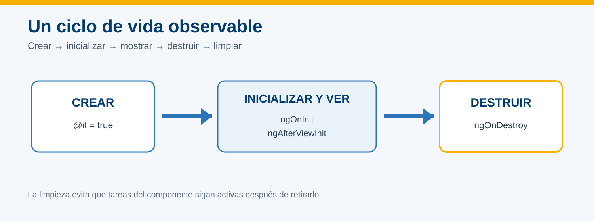
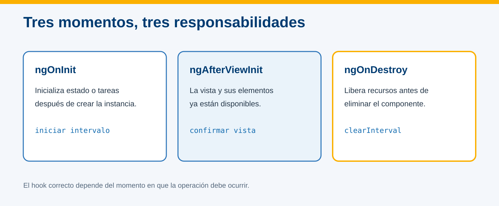
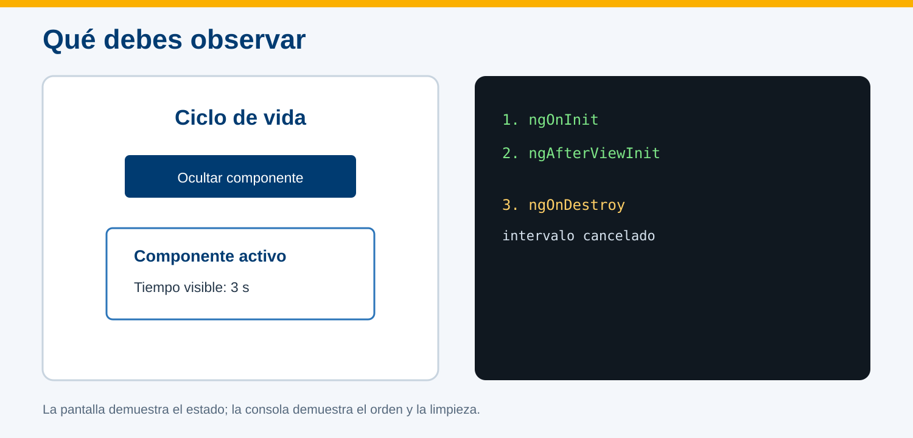

# Ciclo de vida de un componente en Angular



## Información de la práctica

| Campo | Detalle |
| --- | --- |
| **Duración contractual** | 33 minutos |
| **Plataforma** | Windows 11 con PowerShell |
| **Versión** | Angular 21 |
| **Hooks practicados** | `ngOnInit`, `ngAfterViewInit`, `ngOnDestroy` |
| **Resultado** | Creación y destrucción observables en pantalla y consola |

## Objetivo

Implementar tres hooks representativos para distinguir inicialización, disponibilidad de la vista y limpieza antes de destruir un componente.

## Prerrequisitos

- Proyecto `hola-mundo` con la práctica del componente Usuario completada.
- Angular CLI 21 y VS Code disponibles.
- Saber abrir la consola del navegador con `F12`.

## Evidencia

Entrega dos capturas:

1. componente visible con el contador activo;
2. consola después de ocultarlo, mostrando `ngOnDestroy`.

---

## Paso 1. Generar el componente de demostración

**Tiempo sugerido: 4 minutos**

En PowerShell:

```powershell
Set-Location $env:USERPROFILE\angular-labs\hola-mundo
ng generate component ciclo-vida --skip-tests --type=component
code .
```

---

## Paso 2. Implementar los hooks

**Tiempo sugerido: 9 minutos**

Reemplaza `src/app/ciclo-vida/ciclo-vida.component.ts` por:

```typescript
import { AfterViewInit, Component, OnDestroy, OnInit } from '@angular/core';

@Component({
  selector: 'app-ciclo-vida',
  imports: [],
  templateUrl: './ciclo-vida.component.html',
  styleUrl: './ciclo-vida.component.css',
})
export class CicloVidaComponent implements OnInit, AfterViewInit, OnDestroy {
  segundos = 0;
  private intervaloId?: ReturnType<typeof setInterval>;

  ngOnInit(): void {
    console.log('1. ngOnInit: componente inicializado');
    this.intervaloId = setInterval(() => this.segundos++, 1000);
  }

  ngAfterViewInit(): void {
    console.log('2. ngAfterViewInit: vista disponible');
  }

  ngOnDestroy(): void {
    if (this.intervaloId) {
      clearInterval(this.intervaloId);
    }
    console.log('3. ngOnDestroy: intervalo cancelado');
  }
}
```

Observa la responsabilidad de cada método:

| Hook | En este ejercicio |
| --- | --- |
| `ngOnInit` | Inicia el contador después de inicializar el componente |
| `ngAfterViewInit` | Confirma que Angular terminó de preparar la vista |
| `ngOnDestroy` | Cancela el intervalo antes de eliminar la instancia |



---

## Paso 3. Crear la vista del componente

**Tiempo sugerido: 4 minutos**

Reemplaza `ciclo-vida.component.html` por:

```html
<section class="panel">
  <h2>Componente activo</h2>
  <p>Tiempo visible: <strong>{{ segundos }} s</strong></p>
</section>
```

Reemplaza `ciclo-vida.component.css` por:

```css
.panel {
  max-width: 520px;
  margin: 1.5rem auto;
  padding: 1.5rem;
  border-left: 8px solid #2c75b9;
  box-shadow: 0 4px 16px #0002;
}
```

---

## Paso 4. Permitir crear y destruir el componente

**Tiempo sugerido: 7 minutos**

Reemplaza `src/app/app.component.ts` por:

```typescript
import { Component } from '@angular/core';
import { CicloVidaComponent } from './ciclo-vida/ciclo-vida.component';

@Component({
  selector: 'app-root',
  imports: [CicloVidaComponent],
  templateUrl: './app.component.html',
  styleUrl: './app.component.css',
})
export class AppComponent {
  mostrarComponente = true;

  alternarComponente(): void {
    this.mostrarComponente = !this.mostrarComponente;
  }
}
```

Reemplaza `src/app/app.component.html` por:

```html
<main>
  <h1>Ciclo de vida</h1>

  <button type="button" (click)="alternarComponente()">
    {{ mostrarComponente ? 'Ocultar componente' : 'Crear componente' }}
  </button>

  @if (mostrarComponente) {
    <app-ciclo-vida></app-ciclo-vida>
  }
</main>
```

La expresión `@if` agrega o retira la instancia del DOM. Al retirarla, Angular ejecuta `ngOnDestroy`.

---

## Paso 5. Ejecutar y observar el ciclo

**Tiempo sugerido: 5 minutos**

1. Ejecuta:

```powershell
ng serve --open
```

2. Abre la consola del navegador con `F12` y selecciona **Console**.
3. Al cargar, confirma:

```text
1. ngOnInit: componente inicializado
2. ngAfterViewInit: vista disponible
```

4. Espera tres segundos y comprueba que el contador avance.
5. Pulsa **Ocultar componente** y confirma:

```text
3. ngOnDestroy: intervalo cancelado
```

6. Pulsa **Crear componente**. Se crea otra instancia y el contador comienza nuevamente desde cero.



## Validación final

- [ ] El contador comienza en cero y aumenta cada segundo.
- [ ] `ngOnInit` aparece antes de `ngAfterViewInit`.
- [ ] Ocultar el componente ejecuta `ngOnDestroy`.
- [ ] Crear otra instancia reinicia el contador.
- [ ] La terminal y la consola no muestran errores.

Guarda las capturas como:

```text
practica-07-ciclo-visible.png
practica-07-ciclo-destruido.png
```

Detén el servidor con `Ctrl+C`.

## Solución rápida de problemas

| Situación | Acción |
| --- | --- |
| No aparece el componente | Confirma `imports: [CicloVidaComponent]`. |
| El botón no cambia la vista | Revisa el evento `(click)` y el nombre del método. |
| No aparece `ngOnDestroy` | Verifica que `@if` rodee al selector del componente. |
| El contador continúa tras ocultar | Confirma `clearInterval(this.intervaloId)` en `ngOnDestroy`. |

## Nota para el instructor

El presupuesto deja **cuatro minutos de margen**. Los hooks restantes deben explicarse de manera conceptual en la presentación; implementarlos todos aquí ocultaría las diferencias importantes y excedería el tiempo contractual. El hook asociado a cambios de entradas se practica mejor junto con la comunicación padre-hijo de la práctica siguiente.
