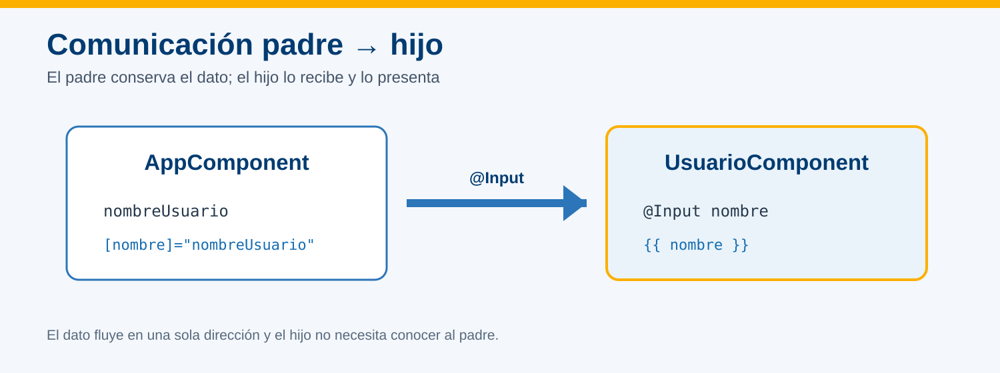
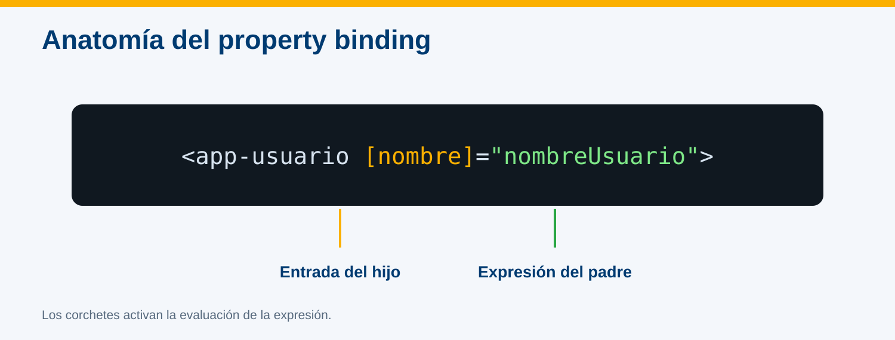
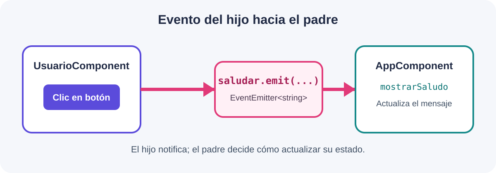
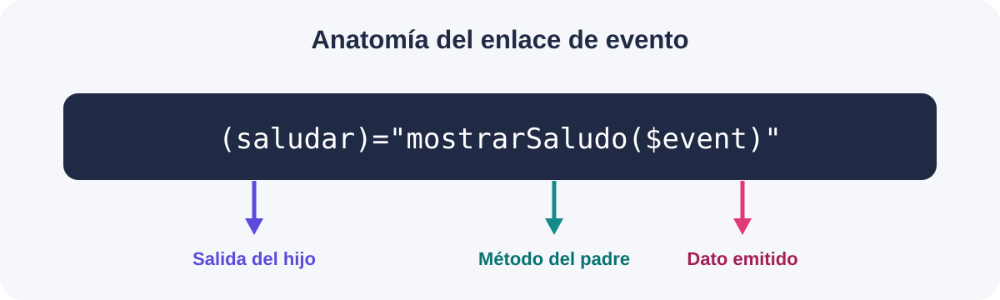

# Decoradores @Input



## Información de la práctica

| Campo | Detalle |
| --- | --- |
| **Duración contractual** | 12 minutos |
| **Proyecto** | `hola-mundo` |
| **Componentes** | `AppComponent` → `UsuarioComponent` |
| **Resultado** | El padre envía un nombre y el hijo lo muestra |

## Objetivo

Convertir la propiedad `nombre` del componente Usuario en una entrada y enlazarla desde `AppComponent` mediante property binding.

## Prerrequisito

La práctica 6 debe estar completada y `<app-usuario>` debe mostrarse correctamente.

---

## Paso 1. Declarar la entrada en el componente hijo

**Tiempo sugerido: 3 minutos**

Abre `src/app/usuario/usuario.component.ts` y realiza dos cambios.

1. Importa `Input`:

```typescript
import { Component, Input } from '@angular/core';
```

2. Sustituye la propiedad `nombre` por:

```typescript
@Input({ required: true }) nombre!: string;
```

La clase debe conservar el decorador `@Component` y quedar así en su parte esencial:

```typescript
export class UsuarioComponent {
  @Input({ required: true }) nombre!: string;
}
```

`required: true` permite que Angular compruebe que el componente padre proporciona el dato.

---

## Paso 2. Enviar el dato desde el componente padre

**Tiempo sugerido: 4 minutos**

En `src/app/app.component.ts`, agrega una propiedad a `AppComponent`:

```typescript
export class AppComponent {
  readonly nombreUsuario = 'Escribe aquí tu nombre';
}
```

En `src/app/app.component.html`, cambia el selector por:

```html
<app-usuario [nombre]="nombreUsuario"></app-usuario>
```



Lectura del enlace:

```text
[nombre]         = "nombreUsuario"
entrada del hijo   propiedad del padre
```

Los corchetes indican que Angular debe evaluar la expresión del lado derecho, no enviar el texto literal `nombreUsuario`.

---

## Paso 3. Ejecutar y comprobar

**Tiempo sugerido: 3 minutos**

1. Ejecuta `ng serve --open` si el servidor no está activo.
2. Comprueba que la tarjeta muestra el valor de `nombreUsuario`.
3. Cambia el valor en `AppComponent`, guarda y confirma que el hijo muestra el nuevo nombre.

Validación:

- [ ] `Input` está importado desde `@angular/core`.
- [ ] El hijo declara `@Input({ required: true }) nombre`.
- [ ] El padre define `nombreUsuario`.
- [ ] El template usa `[nombre]="nombreUsuario"`.
- [ ] No aparece literalmente `nombreUsuario` en la tarjeta.
- [ ] La terminal no muestra errores.

Guarda una captura como:

```text
practica-08-input.png
```

## Solución rápida de problemas

| Situación | Acción |
| --- | --- |
| `No directive found with export` o error de decorador | Confirma la importación de `Input`. |
| La entrada requerida no fue especificada | Agrega `[nombre]="nombreUsuario"` al selector. |
| Se muestra `nombreUsuario` como texto | Confirma que el binding incluye corchetes. |

## Nota para el instructor

El presupuesto deja **dos minutos de margen**. No añadir listas, objetos de producto, alias ni lógica de cambios dinámicos; el objetivo de esta práctica es reconocer el flujo unidireccional padre → hijo. La comunicación inversa se trabaja en la práctica siguiente.

---

# Comunicando un componente hijo con su componente padre utilizando @Output



## Información de la práctica

| Campo | Detalle |
| --- | --- |
| **Duración contractual** | 13 minutos |
| **Proyecto** | `hola-mundo` |
| **Componentes** | `UsuarioComponent` → `AppComponent` |
| **Resultado** | El hijo emite un saludo y el padre lo muestra |

## Objetivo

Emitir un evento tipado desde `UsuarioComponent` y atenderlo en `AppComponent` mediante event binding y `$event`.

## Prerrequisito

La práctica 8 debe estar completada: `AppComponent` envía `nombreUsuario` al hijo mediante `[nombre]`.

---

## Paso 1. Declarar y emitir el evento en el hijo

**Tiempo sugerido: 4 minutos**

Abre `src/app/usuario/usuario.component.ts` e incorpora `Output` y `EventEmitter`:

```typescript
import { Component, EventEmitter, Input, Output } from '@angular/core';
```

Dentro de `UsuarioComponent`, conserva la entrada de la práctica anterior y agrega la salida:

```typescript
export class UsuarioComponent {
  @Input({ required: true }) nombre!: string;
  @Output() saludar = new EventEmitter<string>();

  enviarSaludo(): void {
    this.saludar.emit(`Hola, ${this.nombre}`);
  }
}
```

`emit()` envía el texto que el componente padre recibirá como `$event`.

---

## Paso 2. Disparar el evento desde el template

**Tiempo sugerido: 3 minutos**

Abre `src/app/usuario/usuario.component.html`. Conserva el contenido existente y agrega este botón debajo del nombre:

```html
<button type="button" (click)="enviarSaludo()">
  Enviar saludo
</button>
```

Al hacer clic, Angular ejecutará el método del hijo; el botón no necesita conocer al componente padre.

---

## Paso 3. Escuchar el evento en el padre

**Tiempo sugerido: 4 minutos**

En `src/app/app.component.ts`, agrega una propiedad y el manejador:

```typescript
export class AppComponent {
  readonly nombreUsuario = 'Escribe aquí tu nombre';
  mensajeRecibido = 'Aún no se ha recibido un saludo';

  mostrarSaludo(mensaje: string): void {
    this.mensajeRecibido = mensaje;
  }
}
```

En `src/app/app.component.html`, actualiza el selector y muestra el resultado:

```html
<app-usuario
  [nombre]="nombreUsuario"
  (saludar)="mostrarSaludo($event)">
</app-usuario>

<p>{{ mensajeRecibido }}</p>
```



Lectura del enlace:

```text
(saludar)       = "mostrarSaludo($event)"
salida del hijo    manejador del padre
```

Los paréntesis escuchan el evento. `$event` contiene el valor enviado por `emit()`.

---

## Paso 4. Ejecutar y comprobar

**Tiempo sugerido: 2 minutos**

1. Ejecuta `ng serve --open` si el servidor no está activo.
2. Confirma que inicialmente aparece “Aún no se ha recibido un saludo”.
3. Pulsa **Enviar saludo**.
4. Comprueba que el padre muestra `Hola, Escribe aquí tu nombre`.

Validación:

- [ ] `Output` y `EventEmitter` se importan desde `@angular/core`.
- [ ] El hijo declara `@Output() saludar`.
- [ ] El botón ejecuta `enviarSaludo()`.
- [ ] El padre escucha `(saludar)` y utiliza `$event`.
- [ ] El mensaje cambia al pulsar el botón.
- [ ] La terminal no muestra errores.

Guarda una captura como:

```text
practica-09-output.png
```

## Solución rápida de problemas

| Situación | Acción |
| --- | --- |
| El clic no cambia el mensaje | Confirma que el nombre `saludar` coincide en hijo y padre. |
| `$event` presenta un error de tipo | Verifica `EventEmitter<string>` y `mostrarSaludo(mensaje: string)`. |
| Se imprime `$event` literalmente | Confirma que el binding usa paréntesis y no interpolación. |

## Nota para el instructor

La práctica utiliza todo el presupuesto de **13 minutos**. Mantener un solo evento y un solo dato emitido; los casos de negocio, las colecciones, los detalles de eventos nativos y las múltiples salidas quedan fuera de este objetivo.
