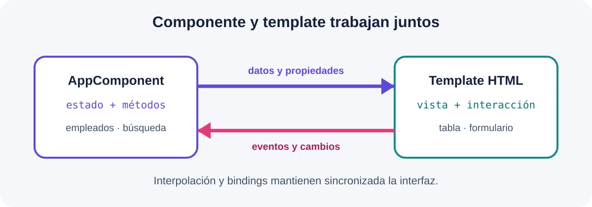
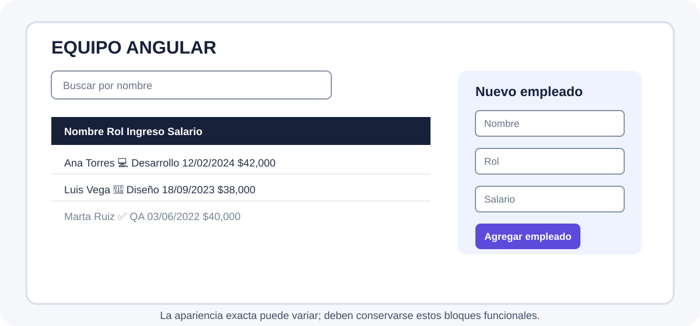
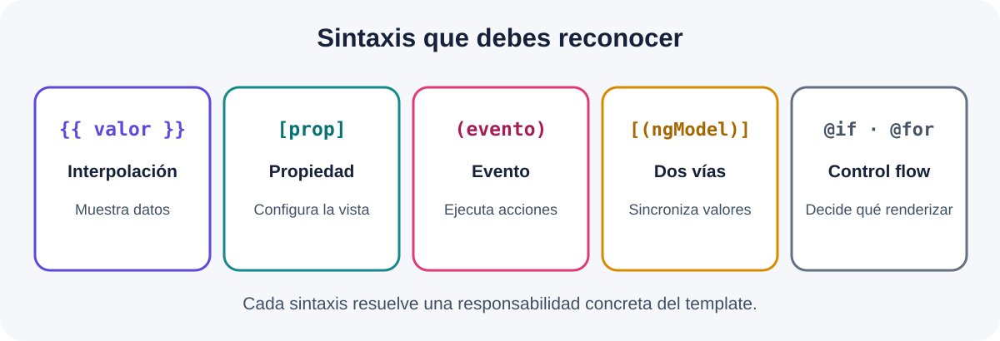

# Uso de Templates



## Información de la práctica

| Campo | Detalle |
| --- | --- |
| **Duración contractual** | 99 minutos |
| **Proyecto** | `lab10-templates` |
| **Versión** | Angular 21 standalone |
| **Resultado** | Lista y formulario de empleados conectados al estado del componente |

## Objetivo

Construir un template que combine interpolación, bindings, control flow moderno, pipes y un formulario template-driven, sin incorporar infraestructura ajena al capítulo.

## Resultado esperado



---

## Paso 1. Crear el proyecto

**Tiempo sugerido: 8 minutos**

En PowerShell:

```powershell
ng new lab10-templates --standalone --routing=false --style=css --file-name-style-guide=2016
cd lab10-templates
ng serve --open
```

Comprueba que `http://localhost:4200` abre sin errores. Mantén el servidor activo.

---

## Paso 2. Definir el modelo y el estado

**Tiempo sugerido: 15 minutos**

Crea `src/app/empleado.ts`:

```typescript
export interface Empleado {
  id: number;
  nombre: string;
  rol: 'Desarrollo' | 'Diseño' | 'QA';
  activo: boolean;
  fechaIngreso: Date;
  salario: number;
}
```

Sustituye `src/app/app.component.ts` por:

```typescript
import { CurrencyPipe, DatePipe, UpperCasePipe } from '@angular/common';
import { Component } from '@angular/core';
import { FormsModule, NgForm } from '@angular/forms';
import { Empleado } from './empleado';

@Component({
  selector: 'app-root',
  standalone: true,
  imports: [FormsModule, CurrencyPipe, DatePipe, UpperCasePipe],
  templateUrl: './app.component.html',
  styleUrl: './app.component.css'
})
export class AppComponent {
  titulo = 'Equipo Angular';
  terminoBusqueda = '';
  empleadoSeleccionado: Empleado | null = null;

  empleados: Empleado[] = [
    { id: 1, nombre: 'Ana Torres', rol: 'Desarrollo', activo: true,
      fechaIngreso: new Date('2024-02-12'), salario: 42000 },
    { id: 2, nombre: 'Luis Vega', rol: 'Diseño', activo: true,
      fechaIngreso: new Date('2023-09-18'), salario: 38000 },
    { id: 3, nombre: 'Marta Ruiz', rol: 'QA', activo: false,
      fechaIngreso: new Date('2022-06-03'), salario: 40000 }
  ];

  nuevoEmpleado = {
    nombre: '',
    rol: 'Desarrollo' as Empleado['rol'],
    salario: 25000
  };

  get empleadosFiltrados(): Empleado[] {
    const texto = this.terminoBusqueda.trim().toLowerCase();
    return this.empleados.filter(e => e.nombre.toLowerCase().includes(texto));
  }

  seleccionar(empleado: Empleado): void {
    this.empleadoSeleccionado = empleado;
  }

  agregar(formulario: NgForm): void {
    if (formulario.invalid) return;

    this.empleados.push({
      id: Date.now(),
      nombre: this.nuevoEmpleado.nombre.trim(),
      rol: this.nuevoEmpleado.rol,
      activo: true,
      fechaIngreso: new Date(),
      salario: this.nuevoEmpleado.salario
    });

    formulario.resetForm({ rol: 'Desarrollo', salario: 25000 });
  }
}
```

El componente contiene únicamente el estado y las acciones que utilizará el template.

---

## Paso 3. Aplicar interpolación y bindings

**Tiempo sugerido: 12 minutos**

Inicia `src/app/app.component.html` con:

```html
<main class="contenedor">
  <h1>{{ titulo | uppercase }}</h1>

  <label for="buscar">Buscar por nombre</label>
  <input
    id="buscar"
    type="search"
    [(ngModel)]="terminoBusqueda"
    [placeholder]="'Ejemplo: ' + empleados[0].nombre">

  <p>Coincidencias: {{ empleadosFiltrados.length }}</p>
</main>
```

Identifica los mecanismos utilizados:

| Sintaxis | Función |
| --- | --- |
| `{{ titulo }}` | Interpolación |
| `[placeholder]` | Property binding |
| `[(ngModel)]` | Two-way binding |
| `| uppercase` | Pipe |

Escribe un nombre en el buscador y confirma que el contador cambia.

---

## Paso 4. Renderizar la lista con control flow

**Tiempo sugerido: 22 minutos**

Agrega debajo del contador, antes de cerrar `main`:

```html
@if (empleadosFiltrados.length > 0) {
  <table>
    <thead>
      <tr>
        <th>Nombre</th>
        <th>Rol</th>
        <th>Ingreso</th>
        <th>Salario</th>
        <th>Estado</th>
        <th></th>
      </tr>
    </thead>
    <tbody>
      @for (empleado of empleadosFiltrados; track empleado.id) {
        <tr [class.inactivo]="!empleado.activo">
          <td>{{ empleado.nombre }}</td>
          <td>
            @switch (empleado.rol) {
              @case ('Desarrollo') { 💻 Desarrollo }
              @case ('Diseño') { 🎨 Diseño }
              @default { ✅ QA }
            }
          </td>
          <td>{{ empleado.fechaIngreso | date:'dd/MM/yyyy' }}</td>
          <td [style.font-weight]="empleado.salario >= 40000 ? '700' : '400'">
            {{ empleado.salario | currency:'MXN':'symbol-narrow':'1.0-0' }}
          </td>
          <td>{{ empleado.activo ? 'Activo' : 'Inactivo' }}</td>
          <td>
            <button type="button" (click)="seleccionar(empleado)">
              Ver
            </button>
          </td>
        </tr>
      }
    </tbody>
  </table>
} @else {
  <p class="aviso">No hay empleados que coincidan con la búsqueda.</p>
}

@if (empleadoSeleccionado; as empleado) {
  <aside>
    <strong>Empleado seleccionado:</strong>
    {{ empleado.nombre }} — {{ empleado.rol }}
  </aside>
}
```



Comprueba el event binding `(click)`, los bloques `@if`, `@for`, `@switch`, el class binding, el style binding y los pipes.

---

## Paso 5. Crear el formulario template-driven

**Tiempo sugerido: 25 minutos**

Agrega el formulario debajo del bloque de detalle:

```html
<section>
  <h2>Nuevo empleado</h2>

  <form #empleadoForm="ngForm" (ngSubmit)="agregar(empleadoForm)">
    <label for="nombre">Nombre</label>
    <input
      id="nombre"
      name="nombre"
      required
      minlength="3"
      [(ngModel)]="nuevoEmpleado.nombre"
      #nombre="ngModel">

    @if (nombre.invalid && nombre.touched) {
      <small class="error">Captura al menos tres caracteres.</small>
    }

    <label for="rol">Rol</label>
    <select id="rol" name="rol" [(ngModel)]="nuevoEmpleado.rol">
      <option value="Desarrollo">Desarrollo</option>
      <option value="Diseño">Diseño</option>
      <option value="QA">QA</option>
    </select>

    <label for="salario">Salario mensual</label>
    <input
      id="salario"
      name="salario"
      type="number"
      min="10000"
      required
      [(ngModel)]="nuevoEmpleado.salario">

    <p>
      Vista previa:
      {{ nuevoEmpleado.nombre || 'Sin nombre' }} —
      {{ nuevoEmpleado.salario | currency:'MXN':'symbol-narrow':'1.0-0' }}
    </p>

    <button type="submit" [disabled]="empleadoForm.invalid">
      Agregar empleado
    </button>
  </form>
</section>
```

La variable `#empleadoForm` expone el estado del formulario y `#nombre="ngModel"` permite mostrar la validación del campo.

Prueba primero un nombre de dos caracteres; después captura datos válidos y agrega el empleado.

---

## Paso 6. Aplicar estilos mínimos

**Tiempo sugerido: 8 minutos**

Sustituye `src/app/app.component.css` por:

```css
:host { font-family: Arial, sans-serif; color: #17213a; }
.contenedor { max-width: 980px; margin: 2rem auto; padding: 0 1rem; }
input, select, button { padding: .6rem; margin: .35rem .35rem .8rem 0; }
table { width: 100%; border-collapse: collapse; margin: 1rem 0; }
th, td { padding: .7rem; border-bottom: 1px solid #d7ddea; text-align: left; }
.inactivo { color: #6b7280; background: #f3f4f6; }
.aviso, aside, section { padding: 1rem; margin-top: 1rem; background: #eef3ff; }
form { display: grid; max-width: 460px; }
.error { color: #b42318; margin-bottom: .7rem; }
button:disabled { cursor: not-allowed; opacity: .55; }
```

No se requiere una biblioteca visual externa para completar los objetivos del laboratorio.

---

## Paso 7. Validar el resultado

**Tiempo sugerido: 9 minutos**

Realiza estas comprobaciones en orden:

- [ ] El título aparece en mayúsculas.
- [ ] La búsqueda filtra la tabla mientras escribes.
- [ ] El mensaje alternativo aparece cuando no hay coincidencias.
- [ ] **Ver** muestra el empleado seleccionado.
- [ ] Fechas y salarios se presentan mediante pipes.
- [ ] Una fila inactiva tiene estilo diferente.
- [ ] El formulario bloquea nombres menores a tres caracteres.
- [ ] Un envío válido agrega una fila y restablece el formulario.
- [ ] La terminal no presenta errores.

Guarda una captura como:

```text
practica-10-templates.png
```

## Solución rápida de problemas

| Situación | Acción |
| --- | --- |
| `ngModel` no se reconoce | Confirma `FormsModule` en `imports`. |
| Un pipe no se reconoce | Confirma que el pipe correspondiente está importado. |
| `@for` solicita una expresión de seguimiento | Conserva `track empleado.id`. |
| El formulario se envía con datos inválidos | Verifica `required`, `minlength` y `[disabled]`. |

## Nota para el instructor

El presupuesto suma **99 minutos**. No añadir bibliotecas visuales, componentes adicionales, almacenamiento, consumo HTTP ni pruebas automatizadas; pertenecen a otros objetivos. Si el grupo avanza rápido, utilizar el tiempo restante para comparar visualmente interpolación, property binding, event binding y two-way binding dentro del código ya escrito.
