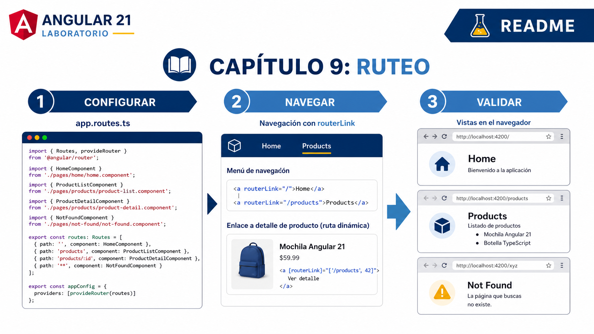

# Implementando Ruteo



## Metadatos

| Campo            | Detalle                          |
|------------------|----------------------------------|
| **Duración**     | 49 minutos                       |
| **Complejidad**  | Media                            |
| **Nivel Bloom**  | Aplicar (Apply)                  |
| **Módulo**       | 9 — Ruteo en Angular             |
| **Versión Angular** | 17.x (modo NgModule)          |

---

## Descripción General

> **Arquitectura objetivo:** Angular 21 standalone con `provideRouter`, Windows 11 y PowerShell. Se conservan los ocho pasos, parámetros, query params, ruta comodín y comparación de estrategias de URL.

En este laboratorio implementarás un sistema de ruteo completo en una aplicación Angular de catálogo de productos. Partirás de un proyecto con cinco componentes ya creados pero sin navegación, y configurarás el `app.routes.ts` para conectarlos mediante rutas con parámetros dinámicos, redirecciones, rutas comodín y parámetros de consulta. Al finalizar comprenderás la diferencia práctica entre navegación declarativa (`routerLink`) y navegación programática (`Router.navigate()`), y habrás comparado las estrategias `PathLocationStrategy` y `HashLocationStrategy`.

---

## Objetivos de Aprendizaje

- [ ] Configurar `provideRouter(routes)` con rutas que mapeen URLs a componentes específicos, incluyendo redirección y ruta comodín (`**`).
- [ ] Implementar navegación declarativa con `routerLink` y `routerLinkActive` en la barra de navegación.
- [ ] Implementar navegación programática usando `Router.navigate()` y `Router.navigateByUrl()` desde la clase del componente.
- [ ] Capturar parámetros de ruta (`ActivatedRoute.snapshot.paramMap`) y parámetros de consulta (`queryParams`) dentro de los componentes destino.
- [ ] Comparar el comportamiento visual de `PathLocationStrategy` versus `HashLocationStrategy` modificando la configuración del módulo de ruteo.

---

## Prerrequisitos

### Conocimiento Previo
- Haber completado la Práctica 8 o tener conocimiento equivalente de servicios Angular e inyección de dependencias.
- Comprensión de la estructura de componentes Angular (decorador `@Component`, plantilla, clase).
- Familiaridad con `NgModule` y el sistema de `imports`/`declarations`.
- Conocimiento básico de URLs, parámetros de ruta y parámetros de consulta HTTP.

### Acceso y Herramientas
- Node.js 22.x instalado y disponible en el PATH.
- Angular CLI 21.x instalado globalmente (`ng version` debe responder sin errores).
- Visual Studio Code con la extensión **Angular Language Service** activa.
- Google Chrome con la extensión **Angular DevTools** instalada.
- Conexión a Internet para instalar dependencias npm (o mirror local configurado por el instructor).

---

## Entorno de Laboratorio

### Requisitos de Hardware

| Componente        | Mínimo                    | Recomendado               |
|-------------------|---------------------------|---------------------------|
| Procesador        | Intel Core i5 / 1.6 GHz   | Intel Core i7 / 2.0 GHz   |
| RAM               | 8 GB                      | 16 GB                     |
| Espacio en disco  | 10 GB libres              | 20 GB libres              |
| Resolución        | 1280 × 768                | 1920 × 1080               |
| Conexión          | 10 Mbps                   | 25 Mbps o superior        |

### Requisitos de Software

| Software                    | Versión mínima   | Versión recomendada |
|-----------------------------|------------------|---------------------|
| Node.js                     | 22.12            | 22.x compatible      |
| npm                         | 10.x             | 10.x                 |
| Angular CLI                 | 21.x             | 21.x                 |
| TypeScript                  | 4.9.x            | 5.x                 |
| Visual Studio Code          | 1.85.x           | Última estable      |
| Google Chrome               | 120.x            | Última estable      |

### Verificación del Entorno

Antes de comenzar, abre una terminal y ejecuta los siguientes comandos para confirmar que tu entorno está listo:

```bash
node --version
# Esperado: v22.x.x (22.12 o superior)

npm --version
# Esperado: 10.x.x

ng version
# Esperado: Angular CLI: 21.x.x
```

---

## Pasos del Laboratorio

> **Nota sobre la sintaxis:** El laboratorio conserva directivas estructurales para practicar su lectura, pero usa composición standalone y `provideRouter`, recomendados para código nuevo en Angular 21.

---

### Paso 1 — Crear el Proyecto Base y los Componentes

**Objetivo:** Generar el proyecto Angular standalone y crear los cinco componentes que se usarán como destinos de navegación.

**Instrucciones:**

1. Abre una terminal en el directorio donde deseas crear el proyecto.

2. Crea el proyecto standalone sin generar rutas automáticamente, porque se configurarán en el paso siguiente:

```bash
ng new catalogo-productos --standalone --routing=false --style=css --file-name-style-guide=2016
```

> Cuando el CLI pregunte si deseas agregar el módulo de ruteo de Angular, responde **No** (`--routing=false`), ya que lo agregaremos manualmente para entender cada paso.

3. Accede al directorio del proyecto:

```bash
cd catalogo-productos
```

4. Genera los cinco componentes que actuarán como páginas de la aplicación:

```bash
ng generate component components/home --type=component
ng generate component components/product-list --type=component
ng generate component components/product-detail --type=component
ng generate component components/about --type=component
ng generate component components/not-found --type=component
```

5. Verifica que los componentes se hayan creado correctamente:

```bash
# En Windows (PowerShell)
Get-ChildItem src/app/components

# En macOS / Linux
ls src/app/components
```

**Salida Esperada:**

```
about/
home/
not-found/
product-detail/
product-list/
```

**Verificación:** confirma que existen las cinco carpetas y que cada clase generada es un componente standalone. Se referenciarán directamente desde `app.routes.ts`.

---

### Paso 2 — Crear `app.routes.ts` y registrar `provideRouter`

**Objetivo:** Crear la configuración de rutas standalone y registrarla en los providers de la aplicación.

**Instrucciones:**

1. Crea `src/app/app.routes.ts`:

```typescript
import { Routes } from '@angular/router';
import { AboutComponent } from './components/about/about.component';
import { HomeComponent } from './components/home/home.component';
import { NotFoundComponent } from './components/not-found/not-found.component';
import { ProductDetailComponent } from './components/product-detail/product-detail.component';
import { ProductListComponent } from './components/product-list/product-list.component';

export const routes: Routes = [
  { path: '', redirectTo: 'home', pathMatch: 'full' },
  { path: 'home', component: HomeComponent },
  { path: 'products', component: ProductListComponent },
  { path: 'products/:id', component: ProductDetailComponent },
  { path: 'about', component: AboutComponent },
  { path: '**', component: NotFoundComponent }
];
```

2. Abre `src/app/app.config.ts` y registra las rutas:

```typescript
import { ApplicationConfig, provideBrowserGlobalErrorListeners } from '@angular/core';
import { provideRouter } from '@angular/router';
import { routes } from './app.routes';

export const appConfig: ApplicationConfig = {
  providers: [provideBrowserGlobalErrorListeners(), provideRouter(routes)]
};
```

**Salida Esperada:** VS Code no muestra errores de TypeScript.

**Verificación:** ejecuta `ng build` para comprobar que el proyecto compila antes de continuar.

---

### Paso 3 — Agregar `router-outlet` y la Barra de Navegación

**Objetivo:** Configurar la plantilla raíz de la aplicación con el punto de inserción de componentes enrutados (`<router-outlet>`) y una barra de navegación con `routerLink` y `routerLinkActive`.

**Instrucciones:**

1. Reemplaza el contenido de `src/app/app.component.html` con el siguiente código:

```html
<!-- src/app/app.component.html -->

<!-- Barra de navegación principal -->
<nav class="navbar">
  <div class="navbar-brand">
    <span>🛍️ Catálogo de Productos</span>
  </div>

  <ul class="navbar-links">
    <!-- routerLink: navegación declarativa -->
    <!-- routerLinkActive: agrega la clase CSS "active-link" cuando la ruta coincide -->
    <li>
      <a routerLink="/home"
         routerLinkActive="active-link">
        Inicio
      </a>
    </li>
    <li>
      <a routerLink="/products"
         routerLinkActive="active-link">
        Productos
      </a>
    </li>
    <li>
      <a routerLink="/about"
         routerLinkActive="active-link">
        Acerca de
      </a>
    </li>
  </ul>
</nav>

<!-- Punto de inserción: aquí Angular renderiza el componente activo -->
<main class="content">
  <router-outlet></router-outlet>
</main>
```

2. Abre `src/app/app.component.ts` y declara las dependencias de navegación:

```typescript
import { Component } from '@angular/core';
import { RouterLink, RouterLinkActive, RouterOutlet } from '@angular/router';

@Component({
  selector: 'app-root',
  imports: [RouterLink, RouterLinkActive, RouterOutlet],
  templateUrl: './app.component.html',
  styleUrl: './app.component.css'
})
export class AppComponent { }
```

3. Agrega los estilos básicos en `src/app/app.component.css`:

```css
/* src/app/app.component.css */

.navbar {
  display: flex;
  justify-content: space-between;
  align-items: center;
  background-color: #3f51b5;
  color: white;
  padding: 0.75rem 1.5rem;
}

.navbar-brand span {
  font-size: 1.25rem;
  font-weight: bold;
}

.navbar-links {
  list-style: none;
  display: flex;
  gap: 1.5rem;
  margin: 0;
  padding: 0;
}

.navbar-links a {
  color: white;
  text-decoration: none;
  padding: 0.25rem 0.5rem;
  border-radius: 4px;
  transition: background-color 0.2s;
}

.navbar-links a:hover {
  background-color: rgba(255, 255, 255, 0.2);
}

/* Clase aplicada por routerLinkActive cuando la ruta está activa */
.navbar-links a.active-link {
  background-color: rgba(255, 255, 255, 0.35);
  font-weight: bold;
  border-bottom: 2px solid white;
}

.content {
  padding: 2rem;
  max-width: 1200px;
  margin: 0 auto;
}
```

4. Inicia el servidor de desarrollo:

```bash
ng serve --open
```

**Salida Esperada:** El navegador abre `http://localhost:4200/` y redirige automáticamente a `http://localhost:4200/home`. La barra de navegación es visible con los tres enlaces. El enlace "Inicio" aparece resaltado (clase `active-link`).

**Verificación:** Haz clic en cada enlace de la barra de navegación y confirma que:
- La URL en la barra del navegador cambia sin recargar la página.
- El enlace activo recibe el estilo diferenciado (fondo semitransparente y subrayado blanco).
- El contenido del `<router-outlet>` cambia mostrando el template por defecto de cada componente.

---

### Paso 4 — Preparar los Datos y el Template de ProductListComponent

**Objetivo:** Dotar al listado de productos de datos de ejemplo y agregar navegación declarativa hacia el detalle de cada producto usando `routerLink` con segmentos dinámicos.

**Instrucciones:**

1. Reemplaza el contenido de `src/app/components/product-list/product-list.component.ts`:

```typescript
// src/app/components/product-list/product-list.component.ts
import { CommonModule } from '@angular/common';
import { Component, OnInit } from '@angular/core';
import { FormsModule } from '@angular/forms';
import { Router, RouterLink } from '@angular/router';

// Interfaz para tipar los productos
interface Product {
  id: number;
  name: string;
  price: number;
  category: string;
}

@Component({
  selector: 'app-product-list',
  imports: [CommonModule, FormsModule, RouterLink],
  templateUrl: './product-list.component.html',
  styleUrl: './product-list.component.css'
})
export class ProductListComponent implements OnInit {

  // Lista completa de productos
  products: Product[] = [
    { id: 1, name: 'Laptop Pro 15"',      price: 1299.99, category: 'Electrónica'  },
    { id: 2, name: 'Teclado Mecánico',    price:   89.99, category: 'Periféricos'  },
    { id: 3, name: 'Monitor 4K 27"',      price:  449.99, category: 'Electrónica'  },
    { id: 4, name: 'Mouse Inalámbrico',   price:   39.99, category: 'Periféricos'  },
    { id: 5, name: 'Auriculares BT Pro',  price:  199.99, category: 'Audio'        },
    { id: 6, name: 'Webcam HD 1080p',     price:   79.99, category: 'Periféricos'  },
  ];

  // Lista filtrada que se muestra en la plantilla
  filteredProducts: Product[] = [];

  // Término de búsqueda ligado al input
  searchTerm: string = '';

  constructor(private router: Router) {}

  ngOnInit(): void {
    // Al iniciar, mostramos todos los productos
    this.filteredProducts = [...this.products];
  }

  // Filtra la lista según el término ingresado
  onSearch(): void {
    const term = this.searchTerm.toLowerCase().trim();
    this.filteredProducts = this.products.filter(p =>
      p.name.toLowerCase().includes(term) ||
      p.category.toLowerCase().includes(term)
    );

    // Navegación programática: actualiza los query params sin recargar
    this.router.navigate(['/products'], {
      queryParams: term ? { search: term } : {}
    });
  }

  // Navegación programática al detalle del producto
  onVerDetalle(productId: number): void {
    this.router.navigate(['/products', productId]);
  }
}
```

2. Reemplaza el contenido de `src/app/components/product-list/product-list.component.html`:

```html
<!-- src/app/components/product-list/product-list.component.html -->

<div class="product-list-container">
  <h2>Catálogo de Productos</h2>

  <!-- Campo de búsqueda con query params -->
  <div class="search-bar">
    <input
      type="text"
      placeholder="Buscar por nombre o categoría..."
      [(ngModel)]="searchTerm"
      (input)="onSearch()"
      class="search-input"
    />
    <span class="result-count">
      {{ filteredProducts.length }} resultado(s)
    </span>
  </div>

  <!-- Listado de productos -->
  <div class="product-grid">
    <div class="product-card" *ngFor="let product of filteredProducts">
      <h3>{{ product.name }}</h3>
      <p class="category">{{ product.category }}</p>
      <p class="price">\${{ product.price | number:'1.2-2' }}</p>

      <!-- Navegación declarativa con segmento dinámico -->
      <a [routerLink]="['/products', product.id]" class="btn-link">
        Ver detalle →
      </a>

      <!-- Navegación programática desde botón -->
      <button (click)="onVerDetalle(product.id)" class="btn-primary">
        Agregar al carrito
      </button>
    </div>
  </div>

  <!-- Mensaje cuando no hay resultados -->
  <div *ngIf="filteredProducts.length === 0" class="no-results">
    <p>No se encontraron productos para "<strong>{{ searchTerm }}</strong>".</p>
    <button (click)="searchTerm=''; onSearch()" class="btn-secondary">
      Limpiar búsqueda
    </button>
  </div>
</div>
```

3. Agrega los estilos en `src/app/components/product-list/product-list.component.css`:

```css
/* src/app/components/product-list/product-list.component.css */

.product-list-container { font-family: sans-serif; }

.search-bar {
  display: flex;
  align-items: center;
  gap: 1rem;
  margin-bottom: 1.5rem;
}

.search-input {
  padding: 0.5rem 0.75rem;
  border: 1px solid #ccc;
  border-radius: 4px;
  font-size: 1rem;
  width: 300px;
}

.result-count { color: #666; font-size: 0.9rem; }

.product-grid {
  display: grid;
  grid-template-columns: repeat(auto-fill, minmax(220px, 1fr));
  gap: 1.25rem;
}

.product-card {
  border: 1px solid #e0e0e0;
  border-radius: 8px;
  padding: 1.25rem;
  display: flex;
  flex-direction: column;
  gap: 0.5rem;
  box-shadow: 0 2px 4px rgba(0,0,0,0.08);
}

.product-card h3 { margin: 0; font-size: 1rem; }
.category { color: #888; font-size: 0.85rem; margin: 0; }
.price { font-size: 1.2rem; font-weight: bold; color: #3f51b5; margin: 0; }

.btn-link {
  color: #3f51b5;
  text-decoration: none;
  font-size: 0.9rem;
}

.btn-primary {
  background: #3f51b5;
  color: white;
  border: none;
  padding: 0.4rem 0.75rem;
  border-radius: 4px;
  cursor: pointer;
  font-size: 0.9rem;
}

.btn-secondary {
  background: #e0e0e0;
  border: none;
  padding: 0.4rem 0.75rem;
  border-radius: 4px;
  cursor: pointer;
}

.no-results {
  text-align: center;
  padding: 2rem;
  color: #666;
}
```

4. Verifica que `ProductListComponent` incluya `FormsModule`, `CommonModule` y `RouterLink` en su decorador standalone:

```typescript
imports: [CommonModule, FormsModule, RouterLink]
```

**Salida Esperada:** Al navegar a `/products` se muestra una cuadrícula de seis tarjetas de producto. Al escribir en el campo de búsqueda la URL se actualiza con el query param `?search=...`. Al hacer clic en "Ver detalle →" la URL cambia a `/products/1` (o el ID correspondiente).

**Verificación:** Escribe "audio" en el buscador y confirma que solo aparece "Auriculares BT Pro" y que la URL muestra `?search=audio`.

---

### Paso 5 — Leer Parámetros de Ruta en ProductDetailComponent

**Objetivo:** Usar `ActivatedRoute` para capturar el parámetro dinámico `:id` de la URL y mostrar el detalle del producto correspondiente.

**Instrucciones:**

1. Reemplaza el contenido de `src/app/components/product-detail/product-detail.component.ts`:

```typescript
// src/app/components/product-detail/product-detail.component.ts
import { CommonModule } from '@angular/common';
import { Component, OnInit } from '@angular/core';
import { ActivatedRoute, Router, RouterLink } from '@angular/router';

interface Product {
  id: number;
  name: string;
  price: number;
  category: string;
  description: string;
  stock: number;
}

@Component({
  selector: 'app-product-detail',
  imports: [CommonModule, RouterLink],
  templateUrl: './product-detail.component.html',
  styleUrl: './product-detail.component.css'
})
export class ProductDetailComponent implements OnInit {

  // Catálogo de referencia (en una app real vendría de un servicio)
  private readonly catalog: Product[] = [
    { id: 1, name: 'Laptop Pro 15"',     price: 1299.99, category: 'Electrónica', description: 'Procesador Intel i7, 16 GB RAM, SSD 512 GB.', stock: 8  },
    { id: 2, name: 'Teclado Mecánico',   price:   89.99, category: 'Periféricos', description: 'Switches Cherry MX Blue, retroiluminación RGB.', stock: 25 },
    { id: 3, name: 'Monitor 4K 27"',     price:  449.99, category: 'Electrónica', description: 'Panel IPS, 144 Hz, HDR400, 1 ms de respuesta.',  stock: 5  },
    { id: 4, name: 'Mouse Inalámbrico',  price:   39.99, category: 'Periféricos', description: 'Sensor óptico 1600 DPI, batería 18 meses.',       stock: 40 },
    { id: 5, name: 'Auriculares BT Pro', price:  199.99, category: 'Audio',       description: 'Cancelación activa de ruido, 30 h de batería.',   stock: 12 },
    { id: 6, name: 'Webcam HD 1080p',    price:   79.99, category: 'Periféricos', description: 'Autofoco, micrófono integrado, USB-C.',            stock: 18 },
  ];

  product: Product | undefined;
  productId: number = 0;

  constructor(
    private activatedRoute: ActivatedRoute,  // Lectura de parámetros de ruta
    private router: Router                   // Navegación programática
  ) {}

  ngOnInit(): void {
    // Leer el parámetro :id de la URL usando snapshot
    const idParam = this.activatedRoute.snapshot.paramMap.get('id');
    this.productId = idParam ? +idParam : 0;  // Convertir string a número con el operador +

    // Buscar el producto en el catálogo
    this.product = this.catalog.find(p => p.id === this.productId);
  }

  // Navegación programática de regreso al listado
  onVolver(): void {
    this.router.navigate(['/products']);
  }

  // Navegación con navigateByUrl (URL completa como cadena)
  onIrAInicio(): void {
    this.router.navigateByUrl('/home');
  }
}
```

2. Reemplaza el contenido de `src/app/components/product-detail/product-detail.component.html`:

```html
<!-- src/app/components/product-detail/product-detail.component.html -->

<div class="detail-container">

  <!-- Caso: producto encontrado -->
  <div *ngIf="product; else noEncontrado">
    <div class="breadcrumb">
      <a routerLink="/home">Inicio</a> /
      <a routerLink="/products">Productos</a> /
      <span>{{ product.name }}</span>
    </div>

    <div class="detail-card">
      <div class="detail-header">
        <h2>{{ product.name }}</h2>
        <span class="badge">{{ product.category }}</span>
      </div>

      <p class="description">{{ product.description }}</p>

      <div class="detail-meta">
        <span class="price">\${{ product.price | number:'1.2-2' }}</span>
        <span class="stock" [class.low-stock]="product.stock < 10">
          Stock: {{ product.stock }} unidades
        </span>
      </div>

      <div class="detail-actions">
        <!-- Navegación programática con Router.navigate() -->
        <button (click)="onVolver()" class="btn-secondary">
          ← Volver al catálogo
        </button>

        <!-- Navegación programática con Router.navigateByUrl() -->
        <button (click)="onIrAInicio()" class="btn-outline">
          Ir al inicio
        </button>
      </div>
    </div>

    <!-- Muestra el ID leído de la URL para confirmar el parámetro -->
    <p class="debug-info">
      🔍 Parámetro de ruta capturado: <code>id = {{ productId }}</code>
    </p>
  </div>

  <!-- Caso: producto no encontrado -->
  <ng-template #noEncontrado>
    <div class="not-found-msg">
      <h3>Producto no encontrado</h3>
      <p>No existe un producto con ID <strong>{{ productId }}</strong>.</p>
      <button (click)="onVolver()" class="btn-primary">
        Ver todos los productos
      </button>
    </div>
  </ng-template>

</div>
```

3. Agrega los estilos en `src/app/components/product-detail/product-detail.component.css`:

```css
/* src/app/components/product-detail/product-detail.component.css */

.detail-container { max-width: 700px; }

.breadcrumb { font-size: 0.85rem; color: #888; margin-bottom: 1.5rem; }
.breadcrumb a { color: #3f51b5; text-decoration: none; }
.breadcrumb a:hover { text-decoration: underline; }

.detail-card {
  border: 1px solid #e0e0e0;
  border-radius: 8px;
  padding: 2rem;
  box-shadow: 0 2px 8px rgba(0,0,0,0.1);
}

.detail-header {
  display: flex;
  align-items: center;
  gap: 1rem;
  margin-bottom: 1rem;
}

.badge {
  background: #e8eaf6;
  color: #3f51b5;
  padding: 0.2rem 0.6rem;
  border-radius: 12px;
  font-size: 0.8rem;
}

.description { color: #555; line-height: 1.6; margin-bottom: 1.5rem; }

.detail-meta {
  display: flex;
  gap: 2rem;
  align-items: center;
  margin-bottom: 2rem;
}

.price { font-size: 1.75rem; font-weight: bold; color: #3f51b5; }
.stock { color: #4caf50; font-weight: 500; }
.low-stock { color: #f44336; }

.detail-actions { display: flex; gap: 1rem; }

.btn-primary  { background: #3f51b5; color: white; border: none; padding: 0.5rem 1rem; border-radius: 4px; cursor: pointer; }
.btn-secondary{ background: #e0e0e0; border: none; padding: 0.5rem 1rem; border-radius: 4px; cursor: pointer; }
.btn-outline  { background: transparent; border: 2px solid #3f51b5; color: #3f51b5; padding: 0.5rem 1rem; border-radius: 4px; cursor: pointer; }

.debug-info {
  margin-top: 1rem;
  font-size: 0.85rem;
  color: #888;
  background: #f5f5f5;
  padding: 0.5rem 1rem;
  border-radius: 4px;
}

.not-found-msg { text-align: center; padding: 3rem; }
```

**Salida Esperada:** Al navegar a `/products/3` se muestra la tarjeta de detalle del "Monitor 4K 27"" con su descripción, precio y stock. El texto de depuración muestra `id = 3`. Al navegar a `/products/99` se muestra el mensaje "Producto no encontrado".

**Verificación:** Navega manualmente a `http://localhost:4200/products/5` y confirma que aparecen los datos de "Auriculares BT Pro". Haz clic en "← Volver al catálogo" y verifica que la URL regresa a `/products` sin recargar la página.

---

### Paso 6 — Configurar HomeComponent y AboutComponent

**Objetivo:** Agregar contenido significativo a los componentes restantes e incluir navegación programática para demostrar `navigateByUrl`.

**Instrucciones:**

1. Reemplaza el contenido de `src/app/components/home/home.component.html`:

```html
<!-- src/app/components/home/home.component.html -->

<div class="home-container">
  <div class="hero">
    <h1>Bienvenido al Catálogo de Productos</h1>
    <p>Encuentra los mejores productos de tecnología al mejor precio.</p>

    <!-- Navegación declarativa con routerLink -->
    <a routerLink="/products" class="btn-hero">
      Ver Catálogo Completo →
    </a>
  </div>

  <div class="features">
    <div class="feature-card">
      <span class="icon">🖥️</span>
      <h3>Electrónica</h3>
      <p>Laptops, monitores y más.</p>
    </div>
    <div class="feature-card">
      <span class="icon">⌨️</span>
      <h3>Periféricos</h3>
      <p>Teclados, ratones y cámaras.</p>
    </div>
    <div class="feature-card">
      <span class="icon">🎧</span>
      <h3>Audio</h3>
      <p>Auriculares de alta fidelidad.</p>
    </div>
  </div>
</div>
```

2. Agrega estilos básicos en `src/app/components/home/home.component.css`:

```css
/* src/app/components/home/home.component.css */

.home-container { text-align: center; }

.hero {
  background: linear-gradient(135deg, #3f51b5, #7986cb);
  color: white;
  padding: 4rem 2rem;
  border-radius: 12px;
  margin-bottom: 2rem;
}

.hero h1 { font-size: 2rem; margin-bottom: 0.75rem; }
.hero p  { font-size: 1.1rem; margin-bottom: 1.5rem; opacity: 0.9; }

.btn-hero {
  background: white;
  color: #3f51b5;
  padding: 0.75rem 1.5rem;
  border-radius: 25px;
  text-decoration: none;
  font-weight: bold;
  font-size: 1rem;
  transition: transform 0.2s;
  display: inline-block;
}

.btn-hero:hover { transform: scale(1.05); }

.features {
  display: flex;
  justify-content: center;
  gap: 1.5rem;
  flex-wrap: wrap;
}

.feature-card {
  border: 1px solid #e0e0e0;
  border-radius: 8px;
  padding: 1.5rem;
  width: 180px;
  box-shadow: 0 2px 4px rgba(0,0,0,0.08);
}

.icon { font-size: 2.5rem; }
```

3. Reemplaza el contenido de `src/app/components/about/about.component.html`:

```html
<!-- src/app/components/about/about.component.html -->

<div class="about-container">
  <h2>Acerca de Esta Aplicación</h2>
  <p>
    Esta aplicación es un laboratorio de práctica para el módulo de
    <strong>Ruteo en Angular</strong>. Demuestra:
  </p>
  <ul>
    <li>Configuración standalone con <code>provideRouter(routes)</code></li>
    <li>Navegación declarativa con <code>routerLink</code></li>
    <li>Navegación programática con el servicio <code>Router</code></li>
    <li>Parámetros de ruta con <code>ActivatedRoute</code></li>
    <li>Rutas comodín y redirecciones</li>
  </ul>

  <!-- routerLink con arreglo de segmentos -->
  <a [routerLink]="['/products']" class="btn-link">
    Explorar el catálogo
  </a>
</div>
```

4. Reemplaza el contenido de `src/app/components/not-found/not-found.component.html`:

```html
<!-- src/app/components/not-found/not-found.component.html -->

<div class="not-found-container">
  <h1 class="error-code">404</h1>
  <h2>Página no encontrada</h2>
  <p>La URL que intentas acceder no existe en esta aplicación.</p>

  <!-- Navegación declarativa de regreso al inicio -->
  <a routerLink="/home" class="btn-home">
    ← Volver al inicio
  </a>
</div>
```

5. Agrega estilos en `src/app/components/not-found/not-found.component.css`:

```css
/* src/app/components/not-found/not-found.component.css */

.not-found-container {
  text-align: center;
  padding: 4rem 2rem;
}

.error-code {
  font-size: 6rem;
  color: #e0e0e0;
  margin: 0;
  line-height: 1;
}

.btn-home {
  display: inline-block;
  margin-top: 1.5rem;
  background: #3f51b5;
  color: white;
  padding: 0.75rem 1.5rem;
  border-radius: 4px;
  text-decoration: none;
  font-weight: bold;
}
```

> **Imports standalone del paso 6:** los templates de `HomeComponent`, `AboutComponent` y `NotFoundComponent` usan `routerLink`. En cada clase importa `RouterLink` desde `@angular/router` y agrega `imports: [RouterLink]` al decorador `@Component`.

**Salida Esperada:** La página de inicio muestra el hero con gradiente y las tres tarjetas de categoría. La página "Acerca de" muestra la lista de conceptos. Al escribir cualquier URL inválida (por ejemplo `http://localhost:4200/ruta-inexistente`) se muestra el componente 404.

**Verificación:** Navega manualmente a `http://localhost:4200/pagina-que-no-existe` y confirma que aparece el `NotFoundComponent` con el código 404.

---

### Paso 7 — Comparar PathLocationStrategy vs HashLocationStrategy

**Objetivo:** Modificar la configuración del módulo de ruteo para observar la diferencia visual entre las dos estrategias de ruteo disponibles en Angular.

**Instrucciones:**

1. Primero, observa el comportamiento actual (**PathLocationStrategy** — estrategia por defecto):
   - Navega por la aplicación y observa que las URLs tienen la forma `http://localhost:4200/products/3`.
   - Esta es la estrategia `PathLocationStrategy`: URLs limpias sin el símbolo `#`.

2. Ahora activa **HashLocationStrategy** mediante la feature oficial `withHashLocation()` en `app.config.ts`:

```typescript
import { ApplicationConfig } from '@angular/core';
import { provideRouter, withHashLocation } from '@angular/router';
import { routes } from './app.routes';

export const appConfig: ApplicationConfig = {
  providers: [provideRouter(routes, withHashLocation())]
};
```

3. Guarda y observa URLs como `http://localhost:4200/#/products/3`.

4. Documenta la comparación indicada a continuación. PathLocationStrategy genera URLs limpias y requiere fallback a `index.html` en el servidor; HashLocationStrategy evita esa configuración, pero incluye `#`.

5. Restaura la estrategia original quitando `withHashLocation()`:

```typescript
providers: [provideRouter(routes)]
```

**Salida Esperada:**
- Con `HashLocationStrategy`: las URLs muestran `/#/home`, `/#/products`, `/#/products/2`.
- Al restaurar: las URLs vuelven a ser `/home`, `/products`, `/products/2`.

**Verificación:** Abre las Herramientas de Desarrollador de Chrome (F12) → pestaña **Network** y recarga la página. Confirma que solo se carga `index.html` una vez y que las navegaciones posteriores no generan nuevas peticiones HTTP al servidor.

---

### Paso 8 — Leer Query Params con ActivatedRoute

**Objetivo:** Leer los parámetros de consulta que el buscador escribe en la URL y aplicarlos al filtro al cargar el componente.

**Instrucciones:**

1. Actualiza `src/app/components/product-list/product-list.component.ts` para leer los query params al inicializar el componente:

```typescript
// src/app/components/product-list/product-list.component.ts
// Versión actualizada con lectura de query params
import { CommonModule } from '@angular/common';
import { Component, OnInit } from '@angular/core';
import { FormsModule } from '@angular/forms';
import { Router, ActivatedRoute, RouterLink } from '@angular/router';  // <-- Agregar ActivatedRoute

interface Product {
  id: number;
  name: string;
  price: number;
  category: string;
}

@Component({
  selector: 'app-product-list',
  imports: [CommonModule, FormsModule, RouterLink],
  templateUrl: './product-list.component.html',
  styleUrl: './product-list.component.css'
})
export class ProductListComponent implements OnInit {

  products: Product[] = [
    { id: 1, name: 'Laptop Pro 15"',      price: 1299.99, category: 'Electrónica' },
    { id: 2, name: 'Teclado Mecánico',    price:   89.99, category: 'Periféricos' },
    { id: 3, name: 'Monitor 4K 27"',      price:  449.99, category: 'Electrónica' },
    { id: 4, name: 'Mouse Inalámbrico',   price:   39.99, category: 'Periféricos' },
    { id: 5, name: 'Auriculares BT Pro',  price:  199.99, category: 'Audio'       },
    { id: 6, name: 'Webcam HD 1080p',     price:   79.99, category: 'Periféricos' },
  ];

  filteredProducts: Product[] = [];
  searchTerm: string = '';

  constructor(
    private router: Router,
    private activatedRoute: ActivatedRoute  // <-- Inyectar ActivatedRoute
  ) {}

  ngOnInit(): void {
    // Leer el query param 'search' de la URL al inicializar el componente
    // Esto permite que si el usuario comparte la URL con ?search=audio,
    // el filtro se aplique automáticamente al cargar la página.
    const searchParam = this.activatedRoute.snapshot.queryParamMap.get('search');

    if (searchParam) {
      this.searchTerm = searchParam;
    }

    // Aplicar el filtro inicial (con o sin query param)
    this.applyFilter();
  }

  onSearch(): void {
    this.applyFilter();

    // Actualizar los query params en la URL
    this.router.navigate(['/products'], {
      queryParams: this.searchTerm.trim() ? { search: this.searchTerm.trim() } : {}
    });
  }

  private applyFilter(): void {
    const term = this.searchTerm.toLowerCase().trim();
    this.filteredProducts = term
      ? this.products.filter(p =>
          p.name.toLowerCase().includes(term) ||
          p.category.toLowerCase().includes(term)
        )
      : [...this.products];
  }

  onVerDetalle(productId: number): void {
    this.router.navigate(['/products', productId]);
  }
}
```

**Salida Esperada:** Al navegar directamente a `http://localhost:4200/products?search=peri` la lista muestra solo los tres productos de la categoría "Periféricos" y el campo de búsqueda aparece pre-llenado con "peri".

**Verificación:** Copia la URL `http://localhost:4200/products?search=audio` y pégala en una nueva pestaña del navegador. El componente debe cargar ya filtrado, mostrando solo "Auriculares BT Pro".

---

## Validación y Pruebas

Una vez completados todos los pasos, realiza las siguientes verificaciones funcionales completas:

### Lista de Verificación Final

| # | Prueba | URL / Acción | Resultado Esperado |
|---|--------|-------------|-------------------|
| 1 | Redirección raíz | Navegar a `http://localhost:4200/` | Redirige automáticamente a `/home` |
| 2 | Ruta comodín | Navegar a `/cualquier-cosa-invalida` | Muestra `NotFoundComponent` con código 404 |
| 3 | routerLinkActive | Hacer clic en "Productos" en el navbar | El enlace "Productos" recibe el estilo `active-link` |
| 4 | Parámetro de ruta | Navegar a `/products/4` | Muestra el detalle de "Mouse Inalámbrico" |
| 5 | Parámetro inválido | Navegar a `/products/99` | Muestra el mensaje "Producto no encontrado" |
| 6 | Query params escritura | Escribir "teclado" en el buscador | URL cambia a `/products?search=teclado` |
| 7 | Query params lectura | Pegar URL `/products?search=audio` | Componente carga filtrado con "Auriculares BT Pro" |
| 8 | Router.navigate() | Clic en "← Volver al catálogo" en detalle | Navega a `/products` |
| 9 | Router.navigateByUrl() | Clic en "Ir al inicio" en detalle | Navega a `/home` |
| 10 | routerLink dinámico | Clic en "Ver detalle →" en tarjeta del producto 3 | Navega a `/products/3` |

### Verificación con Angular DevTools

1. Abre Chrome DevTools (F12) y activa la extensión **Angular DevTools**.
2. Ve a la pestaña **Router** en Angular DevTools.
3. Navega entre las páginas y observa el árbol de rutas activo en tiempo real.
4. Confirma que al navegar a `/products/2`, el árbol muestra la ruta `products/:id` con el parámetro `id = 2`.

---

## Solución de Problemas

### Problema 1: `ERROR: Cannot match any routes. URL Segment: 'products'`

**Síntomas:**
- La consola del navegador (F12 → Console) muestra el error `Cannot match any routes`.
- Al hacer clic en un enlace de navegación la pantalla queda en blanco o muestra un error.
- El componente no se renderiza dentro del `<router-outlet>`.

**Causa:**
El arreglo `routes` en `app.routes.ts` está definido incorrectamente, o `provideRouter(routes)` no está registrado en `app.config.ts`. También puede ocurrir si hay un error tipográfico en el `path` (por ejemplo, `'product'` en lugar de `'products'`).

**Solución:**

1. Verifica el provider en `app.config.ts`:
```typescript
providers: [provideRouter(routes)]
```

2. Verifica que los paths en `routes` coincidan exactamente con los valores usados en `routerLink`:
```typescript
// Correcto:
{ path: 'products', component: ProductListComponent }
// En la plantilla:
<a routerLink="/products">...</a>
```

3. Asegúrate de que la ruta comodín `**` sea la **última** en el arreglo (Angular evalúa las rutas en orden):
```typescript
const routes: Routes = [
  { path: '',         redirectTo: '/home', pathMatch: 'full' },
  { path: 'home',     component: HomeComponent },
  { path: 'products', component: ProductListComponent },
  // ... otras rutas específicas ...
  { path: '**',       component: NotFoundComponent }  // ← SIEMPRE AL FINAL
];
```

---

### Problema 2: `[(ngModel)]` no funciona — Error `Can't bind to 'ngModel'`

**Síntomas:**
- La consola muestra: `Can't bind to 'ngModel' since it isn't a known property of 'input'`.
- El campo de búsqueda no responde a la escritura del usuario.
- El servidor de desarrollo (`ng serve`) muestra un error de compilación.

**Causa:**
La directiva `ngModel` pertenece a `FormsModule`, que no está importado en `ProductListComponent`. Angular no incluye este módulo por defecto para mantener el bundle lo más pequeño posible.

**Solución:**

Importa `FormsModule` en `ProductListComponent`:

```typescript
import { FormsModule } from '@angular/forms';

@Component({
  imports: [CommonModule, FormsModule, RouterLink]
})
export class ProductListComponent { }
```

Guarda el archivo. El servidor de desarrollo recompilará automáticamente y el error desaparecerá.

---

## Limpieza

Al finalizar el laboratorio, sigue estos pasos para dejar tu entorno en orden:

1. **Detener el servidor de desarrollo** en la terminal con `Ctrl + C`.

2. **Archivar el proyecto** si deseas conservarlo como referencia:
```bash
# Crear un archivo comprimido del proyecto (sin node_modules)
# Referencia secundaria — macOS/Linux:
tar -czf catalogo-productos-lab09.tar.gz --exclude=node_modules catalogo-productos/

# En Windows (PowerShell):
Compress-Archive -Path catalogo-productos -DestinationPath catalogo-productos-lab09.zip -Force
# Nota: Excluir node_modules manualmente si es necesario
```

3. **Eliminar `node_modules`** si necesitas liberar espacio en disco (las dependencias pueden reinstalarse con `npm install`):
```bash
# Referencia secundaria — macOS/Linux:
rm -rf catalogo-productos/node_modules

# En Windows (PowerShell):
Remove-Item -Recurse -Force catalogo-productos\node_modules
```

4. **Verificar que no hay procesos de Node.js activos** en el puerto 4200:
```bash
# Referencia secundaria — macOS/Linux:
lsof -ti:4200 | xargs kill -9 2>/dev/null || echo "Puerto 4200 libre"

# En Windows (PowerShell):
netstat -ano | findstr :4200
# Si aparece un proceso, termínalo con: taskkill /PID <PID> /F
```

---

## Resumen

En este laboratorio implementaste un sistema de ruteo completo en Angular. Los conceptos clave que pusiste en práctica fueron:

| Concepto | Dónde se aplicó | Archivo clave |
|----------|----------------|---------------|
| `provideRouter(routes)` | Registro del router standalone | `app.config.ts` |
| Ruta de redirección (`redirectTo`) | `''` → `/home` | `app.routes.ts` |
| Ruta comodín (`**`) | URLs inválidas → `NotFoundComponent` | `app.routes.ts` |
| `<router-outlet>` | Punto de inserción del componente activo | `app.component.html` |
| `routerLink` declarativo | Barra de navegación y breadcrumb | `app.component.html`, `product-detail.component.html` |
| `routerLinkActive` | Resaltar enlace activo en navbar | `app.component.html` |
| `[routerLink]` con arreglo | Navegación dinámica a detalle | `product-list.component.html` |
| `Router.navigate()` | Redirección tras acción del usuario | `product-list.component.ts`, `product-detail.component.ts` |
| `Router.navigateByUrl()` | Navegación con URL completa | `product-detail.component.ts` |
| `ActivatedRoute.snapshot.paramMap` | Leer parámetro `:id` de la ruta | `product-detail.component.ts` |
| `ActivatedRoute.snapshot.queryParamMap` | Leer `?search=` de la URL | `product-list.component.ts` |
| `NavigationExtras.queryParams` | Escribir query params en la URL | `product-list.component.ts` |
| `PathLocationStrategy` vs `HashLocationStrategy` | Comparación de estrategias | `app.routes.ts` |

### Conceptos para Profundizar

- **[Documentación oficial del Router de Angular](https://angular.dev/guide/routing)** — Guía completa con ejemplos actualizados.
- **[ActivatedRoute — API Reference](https://angular.dev/api/router/ActivatedRoute)** — Diferencia entre `snapshot` (valor fijo al cargar) y `paramMap` observable (reactivo a cambios).
- **[Rutas hijas (child routes)](https://angular.dev/guide/routing/router-tutorial-toh#child-route-configuration)** — Para organizar rutas anidadas en aplicaciones más complejas.
- **[Guards de navegación](https://angular.dev/guide/routing/router-tutorial-toh#milestone-5-route-guards)** — `CanActivate`, `CanDeactivate` para proteger rutas según autenticación o estado del formulario.
- **[Lazy loading de módulos](https://angular.dev/guide/ngmodules/lazy-loading)** — Carga diferida de módulos para optimizar el tiempo de carga inicial de la aplicación.

---
